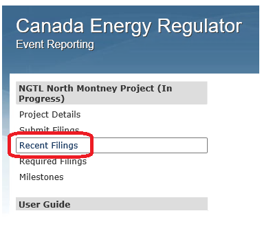

Introduction
============

The Condition Compliance Filing module of the Online Event Reporting
System (OERS) enables companies to efficiently file condition compliance
documents with the Canada Energy Regulator (CER). It also allows
companies to monitor the status of their approved projects, including
their related regulatory instruments, conditions, components, tasks, and
actions required.

This guide provides step-by-step instructions to help users access the
OERS and upload new compliance documents and project milestone dates
(screenshots are examples for demonstration purposes only). For
additional information regarding condition compliance requirements,
please consult the CER’s `Condition and
Enforcement <https://www.cer-rec.gc.ca/en/safety-environment/compliance-enforcement/>`__
webpage.

*Disclaimer:* Regulated companies may communicate with the CER in the
official language of their choice. Certain information may therefore
only appear in one official language within the OERS. Please contact the
Operations Project Manager (OPM) for the project if you have any
questions or concerns.

Contact Us
==========

If you have questions or encounter technical issues while using the
OERS, contact:

Canada Energy Regulator

OERS Support

dlerssupport@cer-rec.gc.ca

1-800-899-1265

Glossary
========

+----------------+-----------------------------------------------------+
| Action         | Sub-elements of a Task, such as Information Request |
| Required       | 1.1, Information Request 1.2.                       |
|                |                                                     |
|                | Actions required only apply to Tasks.               |
+================+=====================================================+
| CER            | Canada Energy Regulator                             |
+----------------+-----------------------------------------------------+
| Component      | Sub-elements of a Condition, such as a), b), i),    |
|                | ii).                                                |
|                |                                                     |
|                | Components only apply to Conditions.                |
+----------------+-----------------------------------------------------+
| Condition      | Requirements in a Regulatory Instrument with which  |
|                | a company must comply to be allowed to construct,   |
|                | operate and/or abandon a project.                   |
+----------------+-----------------------------------------------------+
| Filing         | Documentation, including Notifications, that a      |
|                | company is required to provide to fulfill a         |
|                | Condition and/or an Action Required.                |
+----------------+-----------------------------------------------------+
| IR             | Information Request                                 |
+----------------+-----------------------------------------------------+
| Milestone      | An event (e.g. commencing construction) that will   |
|                | trigger Filings.                                    |
|                |                                                     |
|                | Companies are expected to submit Milestone dates    |
|                | for the major events that will trigger filings.     |
+----------------+-----------------------------------------------------+
| Notification   | A submission (cover letter only) seeking approval   |
|                | for confidential treatment of any information that  |
|                | is likely to be disclosed. For more information on  |
|                | Confidential Filings and cover letter requirements, |
|                | refer to section 1.5 of the CER’s `Filing           |
|                | Manual <https://www.cer-rec.gc.ca/en/a              |
|                | pplications-hearings/submit-applications-documents/ |
|                | filing-manuals/filing-manual/filing-manual.pdf>`__. |
+----------------+-----------------------------------------------------+
| OERS           | Online Event Reporting System                       |
+----------------+-----------------------------------------------------+
| OPM            | Operations Project Manager                          |
+----------------+-----------------------------------------------------+
| Project        | Undertaking to construct, operate and/or abandon a  |
|                | federally regulated facility for which a company    |
|                | applied for and received approval from the          |
|                | Commission of the CER.                              |
+----------------+-----------------------------------------------------+
| REGDOCS        | Regulatory database                                 |
|                | (https://apps.cer-rec.gc.ca/REGDOCS/) for           |
|                | activities and transactions conducted at the CER.   |
+----------------+-----------------------------------------------------+
| Regulatory     | A document authorizing a project/activity which may |
| Instrument     | outline the requirements with which a company must  |
|                | comply (e.g. Commission Order, Certificate, Permit, |
|                | Safety Order, etc.).                                |
+----------------+-----------------------------------------------------+
| Task           | Additional requirements with which a company must   |
|                | comply (e.g. formal and informal IR responses,      |
|                | variance requests (i.e. relief or project updates), |
|                | leave to open applications, etc.).                  |
+----------------+-----------------------------------------------------+

Getting Started
===============

Shortly after the issuance of a regulatory instrument approving a
project, an email which includes a hyperlink to the OERS is sent to the
company contact(s).

To view project-related information and submit filings, access the OERS
using the hyperlink found in the email.

.. image:: CMSMedia/image1.png
   :width: 6.5in
   :height: 2.35831in

General Navigation
==================

Main Menu
---------

The **Main Menu** is located on the left side of the screen throughout
the OERS, and provides quick links to access project details, submit
filings, view recent filings, view required filings, view/update
milestone dates and the user guide.

Below are descriptions of each of the page links found on the Main Menu.

Project Details
---------------

The **Project Details** page contains the following information:

OPM Contact
~~~~~~~~~~~

The email address on this page belongs to the person who is the CER
contact for any project-related questions or concerns.

Email Notification
~~~~~~~~~~~~~~~~~~

Click Subscribe/Unsubscribe to receive/stop receiving email
notifications from the CER when a condition or an action required is
closed.

Instruments and Related Tasks
~~~~~~~~~~~~~~~~~~~~~~~~~~~~~

**►View**

View documents related to an instrument or a task for the project by
clicking the **►View** button (where no documents are available for
viewing, nothing will be displayed).

**View**

View regulatory instruments or tasks for the project by clicking the
blue **View** link; a list of all conditions associated with that
instrument or a list of all actions required associated with that task
will be displayed.

Once on the instrument or task page, hover the mouse over a specific
item to display detailed information and have access to the Submit
Filing button for that item (if a filing is required).

**
**

**Submit Filing**

Submit filings for any regulatory instruments or tasks for the project
by clicking the blue **Submit Filing** link. The Submit Filings page can
also be accessed using the Main Menu.

**View Status**

View the status of any regulatory instruments or tasks for the project
(including the status of individual conditions and actions required) by
clicking the blue **View Status** link.

The status columns will display the current status of the review (in
progress or closed) and the current filing status (no filing required,
under review, satisfactory, etc.). When a condition has components (e.g.
condition 15 below), the status of each individual component will be
displayed.

Note\ **:** The condition status column of a condition that has
components will show closed only when **all** components of that
condition have been deemed satisfactory.

Recent Filings
--------------

The **Recent Filings** page lists recently filed documents for the
project. Filings can be viewed or retracted from this page.

.. image:: CMSMedia/image12.png
   :width: 6.49502in
   :height: 1.99707in

Required Filings
----------------

The **Required Filings** page lists required filings for the project.

The expected filing date is automatically calculated based on the
milestones dates (see the `Milestones <#milestones>`__ section below).

Users can submit filings from this screen by clicking on the blue
**Submit Filing** link beside the relevant item (refer to `How to Submit
a Filing <#how-to-submit-a-filing>`__).

Milestones
----------

Milestones are based on:

-  The information provided by the company in its Application;

-  Construction schedule; and

-  Regulatory requirements.

Examples:

-  Commencing construction;

-  Commencing operations; and

-  Applying for leave to open.

Companies are expected to submit milestone dates for the major events
that will trigger filings.

How To’s
========

How to Submit a Filing
----------------------

On the **Main Menu** (or from any page with a Submit Filing button),
click on **Submit Filings**.

Step 1 – Privacy Disclosure Agreement

Confirm that you have read and understood the Privacy Disclosure
Agreement information by check-marking **I have read and understood the
above information**.

Step 2 – Submitter Contact Information

Enter your contact information in the **Submitter Contact Information**
section (fields with red asterisks are mandatory).

In the **Optional CC email address for filing notification** field,
insert the email addresses of any other parties to whom a copy of the
filing should be sent. Email addresses are to be separated by a comma
**or** a semi-colon followed by a space.

Examples:

karen.hilltop@abccompany.ca, mark.johnston@abccompany.ca

karen.hilltop@abccompany.ca; mark.johnston@abccompany.ca

Checkmark the **Check box to save information so it appears
automatically next time you use the form** checkbox to save the contact
information for subsequent filings.

Step 3 – Filing / Notification

Based on the nature of the documentation being submitted, select either
**Filing** or **Notification**.

Select **Filing** if you are uploading a filing directly to the OERS.

Select **Notification** if you are uploading a request (cover letter
only) seeking approval not to make a filing public. For more information
on Confidential Filings and cover letter requirements, refer to section
1.5 of the CER’s `Filing
Manual <https://www.cer-rec.gc.ca/en/applications-hearings/submit-applications-documents/filing-manuals/filing-manual/filing-manual.pdf>`__.

Note: Companies can upload multiple filings in one submission (maximum
20 documents, each up to 50 MB in size). Companies are **strongly
encouraged to submit documents in their entirety and avoid document
splitting when possible** (e.g. combine your cover letter, filing
information and appendices into the same document and submit one
document, if its size is less than 50 MB). For larger filings, it may be
necessary to make more than one submission.

If difficulties filing through the OERS are experienced, refer to the
CER’s `Filer’s Guide to Electronic
Submission <http://www.cer-rec.gc.ca/pplctnflng/rgltrdcmnt/guide-eng.pdf>`__
for an alternative filing method.

Step 4 – Information on the Filing / Notification

Provide information on the Filing / Notification.

Several regulatory instruments, tasks, conditions, actions required, and
components can be selected when your submission relates to **multiple /
all items**.

In the event a task is created to address a previously-submitted
condition filing (e.g. an IR is created to seek clarity on
previously-submitted condition documents), *select only* the task and
applicable actions required (i.e. *do not select* the condition).

Click the appropriate yellow ‘Add’ button to add your selection. The
details of the selection will appear above the selection boxes.

To remove a selection, click the red circle |image1| beside it.

Instrument / Task

Select the applicable instrument or task from the **Instrument / Task**
drop-down list and click on the yellow **Add Entire Instrument / Task**
button beside the **Condition / Action Required** drop-down list.

If the applicable instrument or task does not appear in the drop-down
list, contact the project’s OPM (refer to `Project
Details <#opm-contact>`__). The OPM will create the OERS entry, as
appropriate, for the instrument, its related conditions and components
(or the task and its related actions required). Once created in the
OERS, all submissions must be submitted against those items.

In the event that the OPM cannot be reached and the filing is
time-sensitive, select (at a minumum) the instrument (if available for
selection in the drop-down list) to which the submission relates, and
click on the yellow **Add Entire Instrument / Task** button beside the
**Condition / Action Required** drop-down list.

Condition / Action Required

Select the applicable condition or action required from the **Condition
/ Action Required** drop-down list.

Click the yellow **Add** button beside it.

If the filing applies to all conditions / actions required, do not
select any items from the **Condition / Action Required** drop-down list
and click on the yellow **Add Entire Instrument / Task** button.

If the applicable condition or action required does not appear in the
drop-down list, contact the project’s OPM.

Component

Select the applicable component from the **Component** drop-down list.

Click the yellow **Add** button beside it.

If the filing applies to all components, do not select any items from
the **Component** drop-down list and click on the yellow **Add All
Components** button.

Please note that components only apply to conditions, and that a
condition may not have any components.

If the applicable component does not appear in the drop-down list,
contact the project’s OPM.

Step 5 – Filing Title and File Selection

In the **Filing Title** field, enter a concise (i.e. brief but
comprehensive) title for the file being submitted.

Examples:

-  Construction Schedule

-  Technical Specification Updates

-  Completion Letter

-  Environmental Protection Plan

**Do not include** the company name, instrument, condition number, etc.
in the title as this information is automatically created by OERS upon
the submission of the filing and will appear as such in REGDOCS.

Click **Browse** to select the document(s) (in PDF format only), up to a
maximum of 20 files.

Once selected, all document(s) will be listed under the Selected Files
heading. If a mistake is made, the user must **reselect all documents**.

Note: Companies can upload multiple filings in one submission (maximum
20 documents, each up to 50 MB in size). Companies are **strongly
encouraged to submit documents in their entirety and avoid document
splitting when possible** (e.g. combine your cover letter, filing
information and appendices into the same document and submit one
document, if its size is less than 50 MB). For larger filings, it may be
necessary to make more than one submission.

Once Steps 1 through 5 are completed, click the green **Submit** button.

Note: The system might take several minutes to upload files that are
near the 50 MB upload limit, or when uploading multiple filings. During
this time, do not refresh the page. An error message will appear if the
upload is not successful. If the problem persists, contact
dlerssupport@cer-rec.gc.ca. If the submission is time-sensitive, submit
the filing using the CER’s `Submit Application and Regulatory
Documents <https://www.cer-rec.gc.ca/en/applications-hearings/submit-applications-documents/>`__
webpage **and** notify the OPM of the Project.

A wide green bar at the top of the screen will appear when the filing(s)
has successfully been submitted.

**Filing Receipt**

Upon successfully submitting a filing, the user will receive a filing
receipt via email. Filing receipts are also available within the filing
folder on REGDOCS. If a filing receipt is not received and is required,
contact the project’s OPM requesting reissuance of the receipt email.

How to Retract a Filing
-----------------------

In the event a filing was submitted incorrectly, the user is required to
submit a retraction request for the incorrect filing **within 24 hours
of submission** and submit the correct filing.

Step 1.

On the **Main Menu**, click on **Recent Filings**.

Step 2.

Click on the blue **Retract** button.

Step 3.

Enter a retraction reason and click **Save**. When the retraction
request is accepted, the project’s OPM will take the appropriate steps
to have the retracted filing removed from REGDOCS, where possible.

How to Edit a Milestone Date
----------------------------

Companies are expected to submit milestone dates for the major events
that will trigger filings. Milestone dates that were previously provided
must be edited to reflect proposed changes in the company’s schedule.

The OERS will utilize milestone dates that have been provided to
calculate filing due dates.

Step 1.

On the **Main Menu**, click on **Milestones**.

Step 2.

Click on the **Edit** link beside a specific milestone to change the
date associated with that milestone.

Step 3.

Enter a new date in the **Revised Milestone Date** field and add a
comment in the **Remark / Justification** field explaining why the date
is being changed.

Click **Save**.

Once Save has been clicked, it will not be possible to edit the date
again until the milestone date has been accepted or declined by the OPM.

The OPM will either accept or decline each milestone date change request
and the user will receive an email notification from OERS confirming the
status of the milestone change request.

**Accepted Milestone Dates**

Should the milestone date be accepted, the email notification may or may
not include a justification as to why it was accepted. Using an accepted
milestone date, the OERS will automatically calculate the expected
filing dates of the required filings associated with that specific
milestone. An accepted milestone date **is not to be considered** **a
regulatory decision** approving any regulatory requirements, including
Conditions, tied to this specific milestone.

**Declined Milestone Dates**

Should the milestone date be declined, the email will include a
justification as to why the milestone date was declined. A declined
milestone date **is not to be considered** **a regulatory decision**
declining any regulatory requirements tied to this specific milestone.

A declined milestone date may indicate that it was entered incorrectly
or that certain regulatory requirements have yet to be satisfied or
approved by the Commission of the CER. When declined, a new milestone
date must be provided.

Frequently Asked Questions
==========================

**Q: How do I submit a document?**

A: Refer to the `How to Submit a Filing <#how-to-submit-a-filing>`__
instructions.

**Q: Can I submit a document that relates to several conditions found on
an instrument or on multiple/different instruments?**

A: Yes. Several items can be selected and added when the submission is
for multiple/all items selected and added from the appropriate drop-down
lists. Refer to the `How to Submit a Filing <#how-to-submit-a-filing>`__
instructions.

**Q: Can I submit a condition document along with a variance request
(i.e. relief or project update)?**

A: Yes. Several items can be selected and added when the submission is
for multiple/all items selected and added from the appropriate drop-down
lists. Refer to the `How to Submit a Filing <#how-to-submit-a-filing>`__
instructions.

**Q: How do I check the status of a filing?**

A: To check the status of a filing, navigate to the **Project Details**
page and click on the blue **View** link under the **Instruments** or
**Related Tasks** headings. Once on the instrument or task page, hover
the mouse over a specific item to display detailed information.

Alternatively, click on **View Status** under the **Instruments** or
**Related Tasks** headings on the **Project Details** page.

**Q: How do I change a milestone date?**

A: Refer to the `How to Edit a Milestone Date <#_How_to_Edit>`__
instructions.

**Q: How do I update company contacts for a project?**

A: Each time a document is submitted, contact information must be
included.

Note: Checkmark **Check box to save contact information** to ensure the
entered contact information appears automatically in the current and
future submissions of documents.

   To update company contact information (i.e. replace, delete or add a
   new contact person), contact the project’s OPM.

