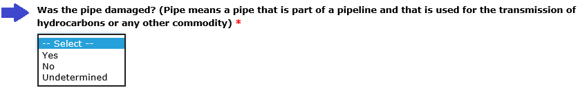
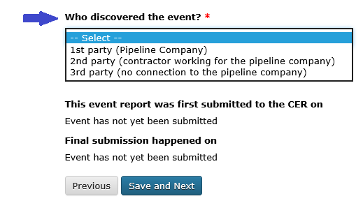
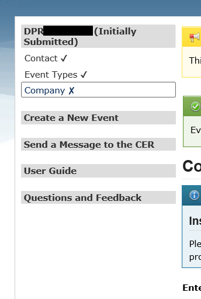
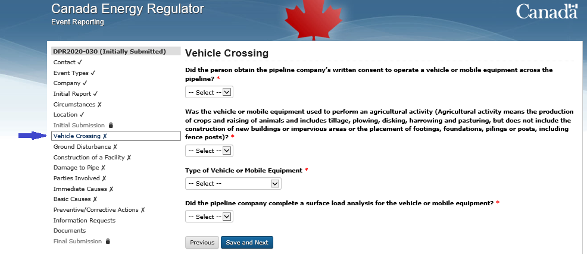
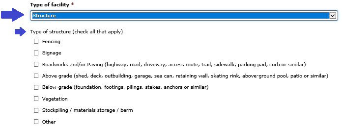
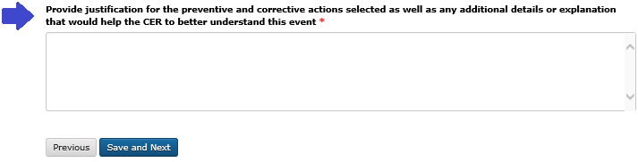

*****************************************
Reporting Contravention of the DPR events
*****************************************

===============
1. Introduction
===============

The Online Event Reporting System (OERS) was created to allow companies
to report regulatory events directly to the Canada Energy Regulator
(CER). OERS is part of a larger system called the Operations Regulatory
Compliance Application (ORCA) which also allows companies to review
their compliance verification activity reports, submit and view the
status of condition filings and interact with CER staff.

In this manual you will find instructions and guidance on how to use
OERS to report Contravention of Damage Prevention Regulations -
Authorizations (DPR-A) events, Damage to Pipe events, and the
information required by the system.

For more information on other types of events required to be reported
and for additional guidance on those Event Types (e.g. Incident
reporting), please see the `*CER Event Reporting
Guidelines* <https://www.cer-rec.gc.ca/bts/ctrg/gnnb/rprtnggdlns/index-eng.html>`__
or the `*CER Remediation Process
Guide* <https://www.cer-rec.gc.ca/sftnvrnmnt/nvrnmnt/rmdtnprcssgd/index-eng.html>`__.

2. Send a Message to the CER
============================

If you have technical questions related to a reported regulatory event,
or would like to request your report be retracted (see section 5.1.2
below), please use the **“Send a Message”** function in left-hand menu
of the OERS system. This will automatically direct your inquiry to the
CER staff assigned to your file.

If you have system issues that prevent you from using this message
button, or a general inquiry that is not related to a reported event,
you can email
`DLERSSupport@cer-rec.gc.ca <mailto:DLERSSupport@neb-one.gc.ca>`__. This
is a monitored email box and CER staff will respond within one business
day.

3. Reportable Contraventions of DPR-A and Damage to Pipe
========================================================

Information defining events reportable to the CER can be found in the
`*CER Event Reporting
Guidelines* <https://www.cer-rec.gc.ca/bts/ctrg/gnnb/rprtnggdlns/index-eng.html>`__.

4 How to create a new event and submit an INITIAL REPORT
========================================================

The first step to reporting involves creating a new Contravention of
DPR-A and/or Damage to Pipe event in OERS. Section 4 of this guide will
show you how to create a new Contravention of DPR-A and/or Damage to
Pipe event in OERS, and all steps up to and including the submission of
your Initial Report to the CER.

4.1 Access OERS
---------------

To create a new event, access the OERS as follows:

1. Access the OERS online using the following URL:
   https://apps.cer-rec.gc.ca/ers

2. A “Welcome” screen will appear as shown below.

3. After reviewing the information in the “Welcome” screen, click
   Continue to proceed with creating a new event.

   |image0|

4.2 Contact Information
-----------------------

Enter the following information in the “Contact” screen shown below.
Mandatory fields are denoted by a red asterisk.

The minimum information required is your first name, last name, work
phone number, and email address. Check the reCAPTCHA box to confirm you
are not a robot, then click **Save and Next** at the bottom of the page.

|image1|

4.3 Email Confirmation
----------------------

After entering your information as described in section 4.2, the “Email
Confirmation” screen shown below will appear and a confirmation message
will automatically be sent to the email address provided. If the email
message does not appear in your email inbox, check your junk email
folder.

A unique link to your new event in the OERS will be included in the body
of the confirmation email. Click the link to be redirected to your event
in OERS. Additional information can then be entered to submit the event
to the CER. If you are not redirected to the OERS after clicking the
link in the email, please contact the CER at DLERSSupport@cer-rec.gc.ca
for assistance.

|image2|

4.4 Event Types
---------------

Once you have clicked on the email link and have been redirected to the
OERS, the “\ **Event Types**\ ” screen will appear as shown below.

|image3|

1. ***Is this an exercise?***

    Confirm whether the event you are reporting is an exercise
    (**Yes/No**).

    | Select **Yes** if you are reporting an exercise.
    | Select **No** if you are providing notification of an actual
      Contravention of DPR-A and/or Damage to Pipe.

1. Under the **Damage Prevention Regulations** heading, select the
   **Event Types** you want to report. Contraventions of DPR-A are
   commonly referred to as unauthorized activities. Select the Event
   Type(s) that best correlate with the activity/activities that caused
   the Contravention of DPR-A.

    If you are reporting Damage to Pipe that is unrelated to a
    Contravention of DPR-A (e.g. historical damage), select “Damage to
    Pipe” as the Event Type.

    Event Types within the **Damage Prevention Regulations** category
    are:

-  Vehicle Crossing;

-  Ground Disturbance;

-  Construction of a Facility; and

-  Damage to Pipe.

**4.4.1 Multiple Event Types **
~~~~~~~~~~~~~~~~~~~~~~~~~~~~~~~

It is possible that a single activity may be associated with multiple
Event Types. If multiple Event Types occur as a result of a single
activity, pipeline companies are expected to report the multiple Event
Types within one report by **selecting all Event Types that apply**. See
the following examples:

4.4.1.1 Example 1: Fencing
^^^^^^^^^^^^^^^^^^^^^^^^^^

Excavation (activity) that caused a ground disturbance in contravention
of DPR-A (Event Type: Ground Disturbance), and a fence post was
installed into the hole on the right-of-way without written consent
(Event Type: Construction of a Facility).

In this example, select **two** Event Types: **Ground Disturbance, and
Construction of a Facility** as shown below

|image4|

4.4.1.2 Example 2: Excavation that Damaged a Pipe
^^^^^^^^^^^^^^^^^^^^^^^^^^^^^^^^^^^^^^^^^^^^^^^^^

Excavation (activity) that caused a ground disturbance in contravention
of DPR-A (Event Type: Ground Disturbance), and which caused damage to a
pipe (Event Type: Damage to Pipe).

In this example, select **two** Event Types\ **: Ground Disturbance, and
Damage to Pipe,** as shown below.

|image5|

4.4.1.3 Example 3: Landscaping
^^^^^^^^^^^^^^^^^^^^^^^^^^^^^^

Landscaping (activity) during which a skid-steer was driven across the
pipeline right-of-way without written consent (Event Type: Vehicle
Crossing), earth cover was removed from the pipeline right-of-way (Event
Type: Ground Disturbance), and a concrete patio was poured over the
pipeline right-of-way without written consent (Event Type: Construction
of a Facility).

In this example, select **three** Event Types: **Vehicle Crossing,
Ground Disturbance, and Construction of a Facility,** as shown below.

|image6|

After you have selected the applicable Event Type(s), click on **Save
and Next** at the bottom of the page to proceed to the next screen.

4.5 Company
------------

Select the name of the company that operates the pipeline associated
with the event you are reporting. If your company name does not appear
on the list, please contact the CER at
`DLERSSupport@cer-rec.gc.ca <mailto:dlerssupport@cer-rec.gc.ca>`__ for
assistance.

|image7|

4.5.1 Selecting regulations
~~~~~~~~~~~~~~~~~~~~~~~~~~~~

After you have selected the company at step 4.5, a list of regulations
will automatically be generated and appear on the screen.

|image8|

-  If you are reporting **Damage to Pipe with no associated
   Contravention of DPR-A**, *Canadian Energy Regulator Pipeline Damage
   Prevention Regulations – Obligations of Pipeline Companies* will be
   the only selection available.

After you have selected the applicable regulation(s), click on **Save
and Next** at the bottom of the page to proceed to the next screen.

4.6 Initial Report
------------------

After you have clicked on **Save and Next** at step 4.5.1, the next
screen is “\ **Initial Report**\ ”.

The first three questions of every **Initial Report** for Contravention
of DPR-A and/or Damage to Pipe are regarding precautionary reporting and
whether the pipe was contacted and/or damaged, as shown below.

|image9|

4.6.1 Is this a precautionary report?
~~~~~~~~~~~~~~~~~~~~~~~~~~~~~~~~~~~~~

The CER has directed companies to take a precautionary approach to
reporting. As a result, the CER is aware that companies will be
reporting a suspected event prior to confirming the final details.
Companies can toggle the “Is this a Precautionary Report” field to
**Yes** to indicate that they are reporting from a precautionary
standpoint. For more information on precautionary reporting please see
the *`CER Event Reporting
Guidelines <https://www.cer-rec.gc.ca/bts/ctrg/gnnb/rprtnggdlns/index-eng.html>`__.*

Was the pipe contacted?
~~~~~~~~~~~~~~~~~~~~~~~

Using the drop-down menu, select **Yes**, **No**, or **Undetermined**.

|image10|

If contact is suspected but **undetermined** within the immediately
reportable timeframe of 24 hours after discovery of the event and there
is no associated contravention of DPR-A being reported, use the
drop-down menu as described in section 4.6.1 above, toggle the “Is this
a Precautionary Report?” field to **Yes** to indicate to the CER that
you are reporting from a precautionary standpoint. You will have the
opportunity to explain the situation and its circumstances on the
“Circumstances” page (see ‘Circumstances’, section 4.7 below).

Was the pipe damaged?
~~~~~~~~~~~~~~~~~~~~~

Using the drop-down menu, select **Yes**, **No**, or **Undetermined**.

|image11|

If you select **Yes**, OERS will automatically generate additional
questions regarding damage to pipe (see section 4.6.3.2 below).

If damage is suspected but **undetermined** within the immediately
reportable timeframe of 24 hours after discovery of the event and there
is no associated contravention of DPR-A being reported, use the
drop-down menu as described in section 4.6.1 above, toggle the “Is this
a Precautionary Report?” field to **Yes** to indicate to the CER that
you are reporting from a precautionary standpoint. You will have the
opportunity to explain the situation and its circumstances on the
“Circumstances” page (see ‘Circumstances’, section 4.7 below).

4.6.3.1 Pipe contacted - No damage to pipe
^^^^^^^^^^^^^^^^^^^^^^^^^^^^^^^^^^^^^^^^^^

If a Contravention of DPR-A resulted in **pipe contact but no pipe
damage,** you will be required to indicate whether the determination of
no damage was made by, or under the direct supervision of, a competent
person. Using the drop-down menu, select **Yes** or **No**. If you
select **No,** OERS will automatically generate a text box to provide
details.

|image12|

4.6.3.2 Damage to Pipe (DTP)
^^^^^^^^^^^^^^^^^^^^^^^^^^^^

If you answered **Yes** to the question **“Was the pipe damaged?”** (see
section 4.6.3 above), OERS will require you to select how the damage was
caused or identified, as shown below. Select all that apply.

|image13|

In addition, OERS will automatically generate additional questions as
shown below.

DTP - Was there damage to the pipe coating?
'''''''''''''''''''''''''''''''''''''''''''

Using the drop-down menu, select **Yes** or **No.**

|image14|

If you select **Yes,** a text box will appear requesting a description
of the coating damage.

|image15|

DTP - Was there damage to the pipe body?
''''''''''''''''''''''''''''''''''''''''

Using the drop-down menu, select **Yes** or **No**.

|image16|

If you select **Yes**:

-  A pick list will appear with options to select **Gouge**, **Dent**,
   or **Other**;

    |image17|

-  A text box will appear requesting a description of the pipe damage;
   and

    |image18|

-  The question “Will an Engineering Assessment (as per CSA Z662) be
   required?” will appear. Using the drop-down menu, select **Yes**,
   **No**, **N/A**, or **Undetermined**.

    |image19|

 Determination of damage
''''''''''''''''''''''''

When a pipe is damaged, you will be required to indicate whether the
determination of damage was made by, or under the direct supervision of,
a competent person. Using the drop-down menu, select **Yes** or **No**.
If you select **No,** OERS will automatically generate a text box to
provide details.

|image20|

4.6.4 Enter the date & time (including time zone) when the event occurred
~~~~~~~~~~~~~~~~~~~~~~~~~~~~~~~~~~~~~~~~~~~~~~~~~~~~~~~~~~~~~~~~~~~~~~~~~~

All reports of Contravention of DPR-A and/or Damage to Pipe require the
date and time when the event occurred, if known.

|image21|

4.6.4.1 Date & Time when the event occurred is Unknown
^^^^^^^^^^^^^^^^^^^^^^^^^^^^^^^^^^^^^^^^^^^^^^^^^^^^^^

If the date, time, and time zone when the event occurred is **unknown**,
tick the available box as shown below.

|image22|

4.6.4.1.1 Historical Damage to Pipe
'''''''''''''''''''''''''''''''''''

If the pipe was damaged and you ticked the box indicating date, time,
and time zone when the event occurred is **unknown** (see section
4.6.4.1 above)\ **,** OERS will automatically generate a mandatory
question **“Is this damage believed to be historical?”** as shown below.
Select **Yes**, **No**, or **Unknown**.

|image23|

4.6.5 Enter the date & time (including time zone) when the event was first discovered
~~~~~~~~~~~~~~~~~~~~~~~~~~~~~~~~~~~~~~~~~~~~~~~~~~~~~~~~~~~~~~~~~~~~~~~~~~~~~~~~~~~~~

All reports of Contravention of DPR-A and Damage to Pipe require date
and time (including time zone) when the event was discovered. The
pipeline company must report Contraventions of DPR-A and Damage to Pipe
events as soon as possible and no later than 24 hours after the event
was discovered. If it is unclear if the event meets CER reportable
criteria, the event can be submitted as a precautionary report (see
section 4.6.1).

|image24|

4.6.6 Who discovered the event?
~~~~~~~~~~~~~~~~~~~~~~~~~~~~~~~

Using the drop-down menu, select the applicable party.

|image25|

4.6.6.1 Method of Discovery - 1st or 2nd party
^^^^^^^^^^^^^^^^^^^^^^^^^^^^^^^^^^^^^^^^^^^^^^

If you indicated that **1st party** or **2nd party** discovered the
event, OERS will generate additional questions as shows below.

1. Use the drop-down menu to select the method of discovery (**Aerial
   patrol**, **Ground patrol**, **Site visit**, or **Other**). If you
   select **Other**, a text box will appear requesting a description.

|image26|

1. If you selected **Aerial patrol**, **Ground Patrol**, or **Site
   visit**, OERS will automatically ask if the method of discovery was
   “\ **Scheduled?”** Using the drop-down menu, select **Scheduled** or
   **Unscheduled**.

|image27|

4.6.6.2 Method of Discovery – 3rd party
^^^^^^^^^^^^^^^^^^^^^^^^^^^^^^^^^^^^^^^

If you indicated that a 3\ :sup:`rd` party discovered the event, OERS
will automatically generate a question regarding “\ **Third Party
Type”.** Using the drop-down menu, select the applicable **Third Party
Type**. If you select “Other”, a text box will appear requesting a
description.

|image28|

4.6.7 Distance from activity to the nearest pipeline signage?
~~~~~~~~~~~~~~~~~~~~~~~~~~~~~~~~~~~~~~~~~~~~~~~~~~~~~~~~~~~~~

Using the drop-down menu, select the applicable distance.

|image29|

When you have finished answering all questions, click **Save and Next**
at the bottom of the page.

4.7 Circumstances
-----------------

The **“Circumstances”** page allows the pipeline company to advise the
CER of any immediate concerns, and to provide a narrative description of
the situation and event(s) being reported.

|image30|

\ **4.7.1 Does the company have any immediate concerns?**

The first question on the Circumstances page is regarding whether the
pipeline company has any immediate concerns for the safety of persons,
the safety of regulated facilities, or the protection of property and
the environment.

Using the drop-down menu, select **Yes** or **No**.

|image31|

**4.7.2 Description – Circumstances leading up to and resulting from the event **
~~~~~~~~~~~~~~~~~~~~~~~~~~~~~~~~~~~~~~~~~~~~~~~~~~~~~~~~~~~~~~~~~~~~~~~~~~~~~~~~~

Provide a complete description of the circumstances leading up to and
resulting from the event including the consequences on the pipeline,
property, and/or the environment.

|image32|

4.7.3 Description - Actions taken or planned to address the consequences of the event
~~~~~~~~~~~~~~~~~~~~~~~~~~~~~~~~~~~~~~~~~~~~~~~~~~~~~~~~~~~~~~~~~~~~~~~~~~~~~~~~~~~~~

Describe all actions taken or planned to address the consequences of the
event including any mitigation, repair, replacement, and/or evacuation
(e.g. pipe will be exposed to inspect for damage, pipeline company has
contacted provincial occupational health and safety; pipe coating was
repaired; pipeline company has initiated an investigation to determine
causes).

|image33|

4.7.4 Circumstances – Ground Disturbance
~~~~~~~~~~~~~~~~~~~~~~~~~~~~~~~~~~~~~~~~

    If you are reporting a Ground Disturbance, OERS will automatically
    prompt you to answer two additional questions regarding the
    equipment that caused the ground disturbance (if known) and the
    approximate distance of the ground disturbance from the physical
    pipe, as shown below.

|image34|

|image35|

When you have finished answering all questions on the Circumstances
page, click **Save and Next** at the bottom of the page.

4.8 Location
------------

The Location page is required for all events. Instructions can be found
at the top of the page.

|image36|

| |image37|
| When you have finished answering all questions, click **Save and
  Next** at the bottom of the page.

4.9 Initial Submission Complete - Submit your Initial Report to the CER
-----------------------------------------------------------------------

The **Initial Submission** is the first step in the two-step reporting
process for the reporting of Contraventions of DPR-A and/or Damage to
Pipe events.

|image38|

When all pages up to **Initial Submission** are displaying checkmarks to
confirm they have been completed (as shown above) you may submit your
Initial Report to the CER by clicking on the green “\ **Submit**\ ”
button.

-  If any pages up to Initial Submission are displaying an **X** instead
   of a checkmark, you must return to that page and complete the
   questions on that page prior to being able to submit your Initial
   Submission to the CER.

-  The pages that are displayed below “Initial Submission” in the
   left-hand menu are generated based on the Event Type(s) you are
   reporting. In the screenshot above, the Event Types selected were
   Vehicle Crossing, Ground Disturbance, Construction of a Facility, and
   Damage to Pipe.

-  The pages that are displayed below “Initial Submission” in the
   left-hand menu will be required to be completed for the Final
   Submission, however they are **not** required to be completed for the
   Initial Submission.

4.9.1 When you click “Submit”:
~~~~~~~~~~~~~~~~~~~~~~~~~~~~~~

1. OERS will automatically generate a message asking you to confirm you
   want to submit. Select **OK** to proceed, as shown below:

|image39|

1. After you click “\ **OK**\ ”, you will receive an email notification
   that includes:

   a. Confirmation the CER has received your Initial Report;

   b. A unique alphanumeric identifier assigned to the event. For all
      reports of Contravention of DPR-A and/or Damage to Pipe, the
      identifier prefix will be DPR;

   c. A link to OERS so you can revise any of the data or provide
      additional information as it becomes available; and

   d. A list of the data you provided to the CER within your Initial
      Submission.

2. An internal notification will be sent within the CER. At any point
   after Initial Submission, you may receive a follow-up communication
   from CER staff.

3. In the left-hand menu of OERS, the Initial Submission page will now
   display a lock icon, as shown below.

    |image40|

1. If you are ready to complete your Final Report right now, you may
   continue to add information on the remaining pages.

2. If you are not ready to complete your Final Report right now, use the
   link you received within the Initial Report confirmation email from
   CER to access OERS at a later time. The timeline for submitting a
   final report for an event can be found in section 7.4 of the CER’s
   Event Reporting Guidelines.

5. How to submit a FINAL REPORT
===============================

Section 5 of this guide will show you how to complete the second step
(**Final Submission**) of reporting Contravention of DPR-A and/or Damage
to Pipe events in OERS. **All pages located below “Initial Submission”
in the left-hand menu are part of the Final Submission**.

5.1 Review the Event Type(s) being reported
-------------------------------------------

In the left-hand menu, pages that are displayed between “Initial
Submission” and “Parties Involved” were generated based on the specific
Event Types you selected in your Initial Report. Each of these pages
will contain questions specific to the Event Types being reported.

In the example shown below, the Event Types selected in the Initial
Report were **Vehicle Crossing**, **Ground Disturbance**, **Construction
of a Facility**, and **Damage to Pipe**. Therefore, each of these Event
Types is now displaying a page in the left-hand menu (see small blue
arrows below).

|image41|

Review the Event Types being reported to confirm the pages being
displayed in the left-hand menu between “Initial Submission” and
“Parties Involved” reflect the Event Types applicable to your **Final
Submission**.

5.1.1 Add or Remove an Event Type
~~~~~~~~~~~~~~~~~~~~~~~~~~~~~~~~~

As new information becomes available after the submission of an Initial
Report, additional Contravention of DPR-A and/or Damage to Pipe Event
Types may need to be added or removed from the **Final Submission**. To
**add or remove** Event Types:

1. Click on the **Event** **Types** page in the left-hand menu (see blue
   arrow above). This will return you to the Event Types page.

2. Add or remove **Event Types** that are applicable to your **Final
   Submission**. See section 4.4 above for information on how to
   navigate the Event Types screen.

3. When you are finished adding or removing **Event Types**, click
   **Save and Next** at the bottom of the page. The **Company** screen
   will automatically appear. **Note that the left-hand menu will appear
   differently until the information on the Company screen is
   re-validated.**

    |image42|

1. You will then be required to re-validate the Company name and
   re-select the applicable regulations as they may have changed due to
   the change in the Event Type (see section 4.5 above for information
   on how to navigate the Company screen). When you are finished the
   Company screen, **click Save and Next** at the bottom of the page.

2. The **Event Type** pages in the left-hand menu will be automatically
   updated based on your selections at step 2 above.

3. You will then be required to re-validate the information on the
   Circumstances page. When you are finished the Circumstances screen,
   **click Save and Next** at the bottom of the Circumstances page.

5.1.2 No reportable events – Request the entire report be retracted
~~~~~~~~~~~~~~~~~~~~~~~~~~~~~~~~~~~~~~~~~~~~~~~~~~~~~~~~~~~~~~~~~~~

As described in section 5.1, the left-hand menu between “Initial
Submission” and “Parties Involved” will display pages that were
generated based on the specific Event Types you selected in your Initial
Report, and any Event Types you have just added per section 5.1.1 above.
Each of these pages will contain questions specific to the Event Types
being reported.

As new information becomes available after the submission of an Initial
Report, the pipeline company may determine that no Contravention of
DPR-A and/or Damage to Pipe occurred, such that the entire report needs
to be retracted. Examples include, but are not limited to:

-  Upon further assessment, the pipeline company confirmed the
   construction of a facility did not occur on, along, across, or under
   the pipeline right-of-way.

-  Upon further assessment, the pipeline company confirmed a ground
   disturbance was less than 30 cm deep and did not result in a
   reduction of the amount of earth cover over the pipeline.

-  A Precautionary Initial Report of Damage to Pipe was submitted and
   upon further assessment, the pipeline company confirmed the pipe was
   not damaged.

**A request to retract the entire report must be submitted to the CER
via the ‘Send a Message to the CER’ function in OERS.** See section 2 of
this guide for information on how to Send a Message to the CER via OERS.

5.2 Vehicle Crossing
---------------------

When “\ **Vehicle Crossing**\ ” is selected as an Event Type, you will
be required to complete a **Vehicle Crossing page**, as shown below.

|image43|

5.2.1 Vehicle Crossing - Written Consent
~~~~~~~~~~~~~~~~~~~~~~~~~~~~~~~~~~~~~~~~

|image44|

If written consent was issued prior to the vehicle or mobile equipment
crossing, a warning message will appear advising the event is not
reportable, as shown below. You will be required to enter a
justification for why the event is being reported, or return to the
Event Types page in the left-hand menu and un-select the “Vehicle
Crossing” Event Type (see section 5.1.1 above).

|image45|

5.2.2 Vehicle Crossing - Agricultural Activity
~~~~~~~~~~~~~~~~~~~~~~~~~~~~~~~~~~~~~~~~~~~~~~

|image46|

Using the drop-down menu, select **Yes** or **No.**

If you select **Yes**, OERS will generate the additional questions (see
sections 5.2.2.1 and 5.2.2.2 below).

5.2.2.1 Vehicle Crossing - Agricultural – Loaded Weight and Tire Pressure
^^^^^^^^^^^^^^^^^^^^^^^^^^^^^^^^^^^^^^^^^^^^^^^^^^^^^^^^^^^^^^^^^^^^^^^^^

|image47|\ Using the drop-down menu, select **Yes**, **No**, or
**Unknown**. If you select **No**, a text box will appear requesting
details.

5.2.2.2 Vehicle Crossing - Agricultural – DPR-O Section 7 Notification
^^^^^^^^^^^^^^^^^^^^^^^^^^^^^^^^^^^^^^^^^^^^^^^^^^^^^^^^^^^^^^^^^^^^^^

|image48|

Using the drop-down menu, select **Yes** or **No**. If you select
**Yes**, a text box will appear requesting details.

5.2.3 Vehicle Crossing - Type of Vehicle or Mobile Equipment
~~~~~~~~~~~~~~~~~~~~~~~~~~~~~~~~~~~~~~~~~~~~~~~~~~~~~~~~~~~~

Using the drop-down menu, select the type of vehicle or mobile equipment
that was operated across the pipeline. If the type is unknown, select
**Unknown**. If you select **Other Equipment**, a text box will appear
requesting details.

|image49|

5.2.4 Vehicle Crossing – Surface Load Analysis
~~~~~~~~~~~~~~~~~~~~~~~~~~~~~~~~~~~~~~~~~~~~~~

|image50|

Using the drop-down menu, select **Yes** or **No**. If you select
**Yes**, a text box will appear requesting a brief summary. A brief
summary should include the following information:

-  make and model of the vehicle or mobile equipment that crossed the
   pipeline; and

-  the potential loading effects of the crossing.

When you have answered all questions, click **Save and Next** at the
bottom of the page.

5.3 Ground Disturbance
----------------------

When “\ **Ground Disturbance**\ ” is selected as an Event Type, you will
be required to complete a **Ground Disturbance page**, as shown below.

|image51|

5.3.1 Ground Disturbance - Type of activity
~~~~~~~~~~~~~~~~~~~~~~~~~~~~~~~~~~~~~~~~~~~

Using the drop-down menu, select the type of activity that caused the
ground disturbance.

|image52|

The following drop-down selections will generate a mandatory text box
requesting details:

-  Excavation for the purpose of installing a new facility

-  Excavation for the purpose of maintaining an existing facility

-  Other

-  Unknown

5.3.2 Ground Disturbance - Type of equipment
~~~~~~~~~~~~~~~~~~~~~~~~~~~~~~~~~~~~~~~~~~~~

Using the drop-down menu, select the type of equipment that caused the
ground disturbance.

|image53|

If the type of equipment is unknown, select **Unknown**. If the type of
equipment is not in the drop-down menu, select **Other** and provide
details in the text box that will appear on the screen.

5.3.3 Ground Disturbance - Distance from centreline of pipe
~~~~~~~~~~~~~~~~~~~~~~~~~~~~~~~~~~~~~~~~~~~~~~~~~~~~~~~~~~~

Enter the distance from centreline of pipe and using the drop-down menu,
select **metres** or **centimetres**. If the activity was directly over
the pipe, enter a distance of “0”.

|image54|

If you enter a distance greater than 30 metres, a warning message will
appear advising the event is not reportable, as shown below. You will be
required to enter a justification for why the event is being reported,
or return to the Event Types page in the left-hand menu and un-select
the “Ground Disturbance” Event Type (see section 5.1.1 above).

|image55|

5.3.4 Ground Disturbance - Depth of activity
~~~~~~~~~~~~~~~~~~~~~~~~~~~~~~~~~~~~~~~~~~~~

Enter the depth of the activity and using the drop-down menu, select
metres or centimetres.

|image56|

5.3.5 Ground Disturbance - Depth of earth cover over the pipe
~~~~~~~~~~~~~~~~~~~~~~~~~~~~~~~~~~~~~~~~~~~~~~~~~~~~~~~~~~~~~

Enter the most recent depth of cover measurement and using the drop-down
menu, select metres or centimetres.

|image57|

5.3.6 Ground Disturbance - Reduction of earth cover over the pipeline
~~~~~~~~~~~~~~~~~~~~~~~~~~~~~~~~~~~~~~~~~~~~~~~~~~~~~~~~~~~~~~~~~~~~~

If the activity resulted in a reduction of earth cover over the
pipeline, select **Yes**. You will then be asked to enter the amount of
reduction of earth cover in either metres or centimetres.

|image58|

**If the activity was** **less than 30 cm deep and did not result in a
reduction in depth of earth cover** **over the pipeline right-of-way**,
a warning message will appear advising the event is not reportable. You
will be required to enter a justification for why the event is being
reported, or return to the Event Types page in the left-hand menu and
un-select the “Ground Disturbance” Event Type (see section 5.1.1 above).
An example is shown below:

|image59|

5.3.7 Ground Disturbance - Authorization
~~~~~~~~~~~~~~~~~~~~~~~~~~~~~~~~~~~~~~~~

Section 10 of the DPR-A identifies requirements for authorization of a
ground disturbance activity within the prescribed area. The following
questions and corresponding screenshots relate to this authorization. If
the activity type selected in section 5.3.1 was *Excavation for the
maintenance of an existing facility*, OERS will automatically display
authorization questions that relate to Section 11 of the DPR-A
(Authorization – activity required for maintenance of facility).

5.3.7.1 Ground Disturbance - Written Consent
^^^^^^^^^^^^^^^^^^^^^^^^^^^^^^^^^^^^^^^^^^^^

|image60|

Using the drop-down menu, select **Yes** or **No**.

5.3.7.2 Ground Disturbance - Locate Request
^^^^^^^^^^^^^^^^^^^^^^^^^^^^^^^^^^^^^^^^^^^

|image61|

Using the drop-down menu, select **Yes** or **No.**

-  If you select **Yes**:

   -  OERS will ask if the pipe was located prior to the ground
      disturbance. Select **Yes** or **No.** If you select **No**, a
      text box will appear requesting details, as shown below.

   -  A non-mandatory text box will appear where you can enter the One
      Call ticket number, if known.

|image62|

5.3.7.3 Ground Disturbance – Obligations Following Request to Locate
^^^^^^^^^^^^^^^^^^^^^^^^^^^^^^^^^^^^^^^^^^^^^^^^^^^^^^^^^^^^^^^^^^^^

|image63|

Using the drop-down menu, answer **Yes** or **No**.

5.3.7.4 Ground Disturbance – Measures to be followed
^^^^^^^^^^^^^^^^^^^^^^^^^^^^^^^^^^^^^^^^^^^^^^^^^^^^

|image64|\ Using the drop-down menu, select **Yes, No**, or **N/A.** If
written consent was not issued for the activity, select **N/A**. If you
select **No**, OERS will generate a list of measures that were not
complied with. **Select all that apply**.

|image65|

When you have answered all questions, click **Save and Next** at the
bottom of the page.

5.4 Construction of a Facility
------------------------------

When “\ **Construction of a Facility**\ ” is selected as an Event Type,
you will be required to complete a **Construction of a Facility page**,
as shown below.

|image66|

5.4.1 Construction of a Facility - Location
~~~~~~~~~~~~~~~~~~~~~~~~~~~~~~~~~~~~~~~~~~~

|image67|

Using the drop-down menu, select **Yes** or **No**.

If you select **No**, a warning message will appear advising the event
is not reportable, as shown below. You will be required to enter a
justification for why the event is being reported, or return to the
Event Types page in the left-hand menu and un-select the “Construction
of a Facility” Event Type (see section 5.1.1 above).

|image68|

5.4.2 Construction of a Facility – Type of facility
~~~~~~~~~~~~~~~~~~~~~~~~~~~~~~~~~~~~~~~~~~~~~~~~~~~

Using the drop-down menu, select the applicable type of facility.

|image69|

-  If you select **Structure** as the type of facility, OERS will
   generate a list of common structures, as shown below. Select **all
   that apply**. If you select “\ **Other**\ ” a text box will appear
   requesting details.

|image70|

5.4.3 Construction of a Facility - Distance from centreline of pipe
~~~~~~~~~~~~~~~~~~~~~~~~~~~~~~~~~~~~~~~~~~~~~~~~~~~~~~~~~~~~~~~~~~~

Enter the distance from centreline of pipe and using the drop-down menu,
select metres or centimetres. If the activity was directly over the
pipe, enter a distance of “0”.

|image71|

5.4.4 Construction of a Facility – Authorization
~~~~~~~~~~~~~~~~~~~~~~~~~~~~~~~~~~~~~~~~~~~~~~~~

Section 7 of the DPR-A identifies requirements for authorization of the
construction of a facility across, on, along or under a pipeline. The
following questions and screenshots relate to this authorization. If the
type of facility selected in section 5.4.2 was *Overhead line*, OERS
will automatically display authorization questions that relate to
Section 9 of the DPR-A (Authorization for construction of overhead
line).

5.4.4.1 Construction of a Facility – Written Consent
^^^^^^^^^^^^^^^^^^^^^^^^^^^^^^^^^^^^^^^^^^^^^^^^^^^^

|image72|

Using the drop-down menu, select **Yes** or **No**.

5.4.4.2 Construction of a Facility – Locate Request
^^^^^^^^^^^^^^^^^^^^^^^^^^^^^^^^^^^^^^^^^^^^^^^^^^^

|image73|

Using the drop-down menu, select **Yes** or **No.** If you select
**Yes**:

-  OERS will ask if the pipe was located prior to the construction of a
   facility. Select **Yes** or **No.** If you select **No**, a text box
   will appear requesting details, as shown below.

-  A non-mandatory text box will appear where you can enter the one call
   ticket number, if known.

|image74|

5.4.4.3 Construction of a Facility - Obligations Following Request to Locate
^^^^^^^^^^^^^^^^^^^^^^^^^^^^^^^^^^^^^^^^^^^^^^^^^^^^^^^^^^^^^^^^^^^^^^^^^^^^

|image75|

Using the drop-down menu, answer **Yes** or **No**.

5.4.4.4 Construction of a Facility - Measures to be followed
^^^^^^^^^^^^^^^^^^^^^^^^^^^^^^^^^^^^^^^^^^^^^^^^^^^^^^^^^^^^

|image76|

Using the drop-down menu, select **Yes, No,** or **N/A.** If written
consent was not issued for the activity, select **N/A**. If you select
**No**, OERS will generate a list of measures that were not complied
with. **Select all that apply**.

|image77|

When you have answered all questions, click **Save and Next** at the
bottom of the page.

5.5 Damage to Pipe (DTP)
------------------------

When “\ **Damage to Pipe**\ ” is selected as an Event Type, you will be
required to complete a **Damage to Pipe page**, as shown below.

|image78|

5.5.1 DTP – Type of Damage
~~~~~~~~~~~~~~~~~~~~~~~~~~

Any DTP information that was submitted by the pipeline company within
the Initial Report will automatically populate into this DTP page.

|image79|

Review any auto-populated information on this page. Make corrections,
additions, and deletions as required. Types of pipe damage available for
selection are **Gouge**, **Dent**, and/or **Other**. Select **all that
apply.** Depending on your selection(s)\ **,** OERS will automatically
generate additional questions as shown below.

5.5.1.1 DTP - Type of Damage - Gouge
^^^^^^^^^^^^^^^^^^^^^^^^^^^^^^^^^^^^

If you select **Gouge**, OERS will generate the following mandatory
questions:

|image80|

-  **Width and length measurements** are in millimetres.

-  **Depth measurement** can be entered in millimetres or as % of actual
   wall thickness by using the drop-down menu.

-  **Location (Clock position)** is determined by looking downstream.
   The top of the pipe is the 12 o’clock position. The bottom of the
   pipe is the 6 o’clock position. 

5.5.1.2 DTP - Type of Damage - Dent
^^^^^^^^^^^^^^^^^^^^^^^^^^^^^^^^^^^

If you select **Dent**, OERS will generate the following mandatory
questions:

|image81|

-  **Width and length measurements** are in millimetres.

-  **Depth measurement** can be entered in millimetres or as % of actual
   wall thickness by using the drop-down menu.

-  **Location (Clock position**) is determined by looking downstream.
   The top of the pipe is the 12 o’clock position. The bottom of the
   pipe is the 6 o’clock position.

-  **Interaction with a mill or field weld?** Select **Yes** or **No.**

-  **Presence of corrosion?** Select **Yes** or **No.**

-  **Presence of stress concentrators** (e.g. gouges, grooves, arc
   burns, or cracks)? Select **Yes** or **No.**

-  **Strain (Percentage)** is a non-mandatory question. Indicate strain
   percentage, if known.

5.5.1.3 DTP – Type of Damage - Other
^^^^^^^^^^^^^^^^^^^^^^^^^^^^^^^^^^^^

If you select **Other,** OERS will request a description.

|image82|

5.5.2 DTP – Description of pipe damage
~~~~~~~~~~~~~~~~~~~~~~~~~~~~~~~~~~~~~~

Provide a description of the pipe damage including a summary of NDE
results (if applicable), available dimensions, and interactions with
other features (if applicable).

|image83|

5.5.3 DTP – Has the damage been mitigated?
~~~~~~~~~~~~~~~~~~~~~~~~~~~~~~~~~~~~~~~~~~

Using the drop-down menu, select **Mitigation has been completed,
Mitigation to be done,** or **Mitigation is not required.**

|image84|

5.5.3.1 DTP – Mitigation has been completed
^^^^^^^^^^^^^^^^^^^^^^^^^^^^^^^^^^^^^^^^^^^

If **mitigation has been completed** (see section 5.5.3 above), you will
be required to specify what measures were taken to mitigate the damage.

|image85|

5.5.3.2 DTP – Mitigation to be done
^^^^^^^^^^^^^^^^^^^^^^^^^^^^^^^^^^^

If **mitigation is to be done** (see section 5.5.3 above), you will be
required to provide a mitigation plan with timelines.

|image86|

5.5.3.2.1 DTP – Interim mitigation measures
'''''''''''''''''''''''''''''''''''''''''''

|image87|

Using the drop-down menu, select **Yes** or **No**.

-  If you selected **Yes**, a text box will appear asking you to specify
   what interim measures were taken.

-  If you select **No**, a text box will appear asking you to specify
   how the company maintains the safety of the pipeline, people, and
   environment until mitigation measures are implemented.

5.5.3.3 DTP - Mitigation not required
^^^^^^^^^^^^^^^^^^^^^^^^^^^^^^^^^^^^^

If **mitigation is not required** (see section 5.5.3 above), you will be
asked to explain why mitigation is not required.

|image88|

When you have answered all questions, click **Save and Next** at the
bottom of the page.

5.6 Parties Involved
--------------------

The **“Parties Involved”** screen will automatically populate based on
the Event Type(s) being reported.

5.6.1 Parties Involved – Definitions
~~~~~~~~~~~~~~~~~~~~~~~~~~~~~~~~~~~~

-  **Ground Disturber**: the party that disturbed the ground.

-  **Facility Constructor:** the party that constructed the facility.

-  **Vehicle or Mobile Equipment Operator**: the party that operated the
   vehicle or mobile equipment across the pipeline.

-  **Damaging Party**: the party that damaged the pipe.

-  **Project Owner**: the party that initiated the work; the party the
   Ground Disturber, Facility Constructor, and/or Damaging Party was
   carrying out the work on behalf of.

   -  Example #1: A landowner initiated the work and did the excavation
      herself: the landowner is both the Project Owner and the Ground
      Disturber.

   -  Example #2: A landowner hired a contractor to construct a facility
      on the right-of-way: the landowner is the Project Owner and the
      friend is the Facility Constructor.

   -  Example #3: A developer initiated the work and contracted the work
      to a professional excavator who damaged the pipe: the developer is
      the Project Owner and the excavator is both the Ground Disturber
      and the Damaging Party.

5.6.2 Parties Involved – Default Parties based on Event Types being reported
~~~~~~~~~~~~~~~~~~~~~~~~~~~~~~~~~~~~~~~~~~~~~~~~~~~~~~~~~~~~~~~~~~~~~~~~~~~~

1. If you are reporting a **Vehicle Crossing**, OERS will automatically
   generate “\ **Vehicle or Mobile Equipment Operator”** as the single
   default Party Involved Type.

|image89|

1. If you are reporting a **Ground Disturbance**, OERS will
   automatically generate **“Ground Disturber”** and **“Project Owner”**
   as the two default Party Involved Types.

   |image90|

2. If you are reporting the **Construction of a Facility**, OERS will
   automatically generate **“Project Owner”** and **“Facility
   Constructor”** as the two default Party Involved Types.

    |image91|

1. If you are reporting **Damage to Pipe**, OERS will automatically
   generate ‘\ **Damaging Party**\ ” as the single default Party
   Involved Type.

|image92|

5.6.3 Parties Involved – Enter Details
~~~~~~~~~~~~~~~~~~~~~~~~~~~~~~~~~~~~~~

Click the **Enter Details** button to enter each party’s details.

Using the drop-down menu, select the type that best describes the party
involved. Select **1\ :sup:`st` party (pipeline company)**,
**2\ :sup:`nd` party (contractor working for the pipeline company)**,
**3\ :sup:`rd` party (no connection to the pipeline company)**, or
**Unknown**.

|image93|\ |image94|

If you select **2\ :sup:`nd` party** **(contractor working for the
pipeline company)** or **3\ :sup:`rd` party (no connection to the
pipeline company),** additional questions will automatically be
generated and appear on the screen, as shown below.

5.6.3.1 Parties Involved – 2\ :sup:`nd` or 3\ :sup:`rd` party
^^^^^^^^^^^^^^^^^^^^^^^^^^^^^^^^^^^^^^^^^^^^^^^^^^^^^^^^^^^^^

|image95|

5.6.3.1.1 Parties Involved – 2\ :sup:`nd` or 3\ :sup:`rd` party – Repeat Occurrence for the party?
''''''''''''''''''''''''''''''''''''''''''''''''''''''''''''''''''''''''''''''''''''''''''''''''''

Using the drop-down menu, select **Yes** or **No.** If you select
**Yes**, OERS will automatically generate a text box requesting the
date, file number, and a brief description of all previous occurrences.

|image96|

5.6.3.1.2 Parties Involved – 2\ :sup:`nd` or 3\ :sup:`rd` party – Name of company
'''''''''''''''''''''''''''''''''''''''''''''''''''''''''''''''''''''''''''''''''

Using the text box, enter the name of the company involved. The text box
is mandatory for a 2\ :sup:`nd` party and optional for a 3\ :sup:`rd`
party.

|image97|

5.6.3.1.3 Parties Involved – 2\ :sup:`nd` or 3\ :sup:`rd` party - Advise party of event submission to the CER
'''''''''''''''''''''''''''''''''''''''''''''''''''''''''''''''''''''''''''''''''''''''''''''''''''''''''''''

Using the drop-down menu, select **Yes** or **No.**

5.6.3.1.4 Parties Involved – 2\ :sup:`nd` or 3\ :sup:`rd` party – Public Awareness Distribution List
''''''''''''''''''''''''''''''''''''''''''''''''''''''''''''''''''''''''''''''''''''''''''''''''''''

Using the drop-down menu, select **Yes** or **No.**

-  If you select **Yes,** the following questions will appear:

    |image98|

-  If you select **No,** the following question will appear:

|image99|

If you select **No**, a text box will appear requesting details.

When you have finished entering a party’s details, click **Save** at the
bottom of the screen. You will be automatically redirected back to the
**Parties Involved** main page. From the **Parties Involved** main page,
you are now able to **Edit Details** or **Enter Details**, as
applicable.

|image100|

If multiple parties involved have the same details, see section 5.6.5
below.

5.6.4 Parties Involved – Multiple Event Types
~~~~~~~~~~~~~~~~~~~~~~~~~~~~~~~~~~~~~~~~~~~~~

If you are reporting multiple Event Types, OERS will automatically
generate multiple default Parties Involved.

-  Example #1: **Ground Disturbance and Damage to Pipe**

|image101|

-  Example #2: **Vehicle Crossing, Ground Disturbance, and Construction
   of a Facility**

    |image102|

5.6.5 Parties Involved – Multiple Event Types – When Parties Involved have the same details
~~~~~~~~~~~~~~~~~~~~~~~~~~~~~~~~~~~~~~~~~~~~~~~~~~~~~~~~~~~~~~~~~~~~~~~~~~~~~~~~~~~~~~~~~~~

If some or all of the parties involved have the same details (e.g. the
Ground Disturber and the Project Owner are the same person) you **do
not** have to re-enter the same information for each party involved.
Instead, **follow the steps below:**

-  Click on **Enter Details** for the Project Owner, and enter all of
   the party’s details.

   |image103|

-  Then click on **Enter Details** for the second party involved. In the
   example below, the only other party involved is the Ground Disturber:

   |image104|

-  Using the drop-down menu, select “\ **Same as Project Owner”.**

   |image105|

-  If there are additional default parties involved, and they all have
   the same details as the Project Owner, repeat the steps above for
   each of the parties involved.

5.6.6 Parties Involved – Add Additional Party
~~~~~~~~~~~~~~~~~~~~~~~~~~~~~~~~~~~~~~~~~~~~~

The **“Parties Involved”** screen will automatically populate based on
the Event Type(s) being reported (see section 4.4 above). To add
additional parties:

-  Click on the **Add Additional Party** button, as shown below;

   |image106|

-  Enter the party’s details; and

-  When you have finished entering the additional party’s details, click
   **Save** at the bottom of the screen.

5.7 Immediate Causes and Basic Causes
-------------------------------------

The CER’s framework of immediate and basic causes within OERS was
informed by the Canadian Standards Association (CSA) Z662 Annex H and
Det Norske Veritas (DNV) Systemic Cause Analysis Technique (SCAT). Use
of another root cause technique (e.g. TapRoot) does not preclude the
ability of a company to submit causes. The CER acknowledges that the
cause wordings may differ between the techniques, however, the vast
majority of causes have equivalents in each of the cause techniques.

5.7.1 Immediate Causes
~~~~~~~~~~~~~~~~~~~~~~

**Immediate Causes** for Contraventions of DPR-A and Damage to Pipe
events are grouped as follows: **Notification Issue**, **Locate Issue**,
**Written Consent Issue**, **Excavation Issue**, and **Historical Damage
(cause unknown**).

Click on the individual arrows to expand each group of items, as shown
below.

|image107|

You can also click **“Expand All”** to show all items in all groups, as
shown below.

|image108|

**Select all immediate causes that apply.**

When you have finished making your selections, you **must provide
justification** for the immediate causes selected as well as any
additional details or explanation that would help the CER to better
understand the immediate causes of this event, as shown below. For
example, if there are multiple parties involved, you can use this text
box to explain the role and immediate causes that the pipeline company
has determined are attributed to specific parties involved.

|image109|

When you have answered all questions, click **Save and Next** at the
bottom of the page.

5.7.2 Basic Causes
~~~~~~~~~~~~~~~~~~

**Basic Causes** for Contraventions of DPR-A and Damage to Pipe events
are grouped as follows: **Job or** **System Factors,** **Personal
Factors**, **External Interference**, and **Historical Damage (cause
unknown).**

|image110|

Click on the individual arrows to expand each group of items. You can
also click **“Expand All”** to show all items in all groups, as shown
below.

|image111|

|image112|

|image113|

|image114|

|image115|

**Select all basic causes that apply.**

When you have finished making your selections, you **must provide
justification** for the basic causes selected as well as any additional
details or explanation that would help the CER to better understand the
basic causes of this event.

When you have answered all questions, click **Save and Next** at the
bottom of the page.

\ **5.8 Corrective Actions and Preventive Actions**

On this page, companies are to select all actions taken in response to
the event. The CER expects that action(s) will be taken to address each
cause selected. The CER is aware that there are different definitions of
corrective and preventive actions. For more information on how the CER
defines corrective and preventive actions please see Appendix 1 of the
*`CER Event Reporting
Guidelines <https://www.cer-rec.gc.ca/bts/ctrg/gnnb/rprtnggdlns/index-eng.html>`__.*

Click on the individual arrows to expand each group of items. You can
also click **“Expand All”** to show all items in all groups.

|image116|

5.8.1 Corrective Actions
~~~~~~~~~~~~~~~~~~~~~~~~

**Corrective Actions** are actions taken at the event site to remove or
control the cause(s) in order to eliminate the hazard, or minimize the
associated risk. S\ **elect all that apply.**

|image117|

5.8.2 Tier 1 Preventive Actions
~~~~~~~~~~~~~~~~~~~~~~~~~~~~~~~

**Tier 1 Preventive Actions** are actions taken to address causes at
additional locations where similar/identical situations exist in order
to proactively eliminate the identified risk. **Select all that apply.**

|image118|

5.8.3 Tier 2 Preventive Actions
~~~~~~~~~~~~~~~~~~~~~~~~~~~~~~~~

**Tier 2 Preventive Actions** are actions taken to address systemic
causes; typically associated with changes that impact the entire company
or pipeline. **Select all that apply.**

|image119|

5.8.4 Justification of Corrective and Preventive Actions selected
~~~~~~~~~~~~~~~~~~~~~~~~~~~~~~~~~~~~~~~~~~~~~~~~~~~~~~~~~~~~~~~~~

When you have finished making your selections, you **must provide
justification** for the corrective and preventive actions selected, as
well as any additional details or explanation that would help the CER to
better understand this event.

|image120|

When you have answered all questions, click **Save and Next** at the
bottom of the page.

5.9 Information Requests
-------------------------

If the CER sends an Information Request via OERS, the company will
receive an email notification containing a direct link to the
Information Request in OERS. To reply to a CER Information Request in
OERS, click the link within the email or go to the Information Request
page in the left-hand menu in OERS.

If the CER has not sent any Information Requests via OERS, the
Information Requests page will appear as shown below. Click **Next** to
proceed to the next page.

|image121|

5.10 Documents
--------------

The **Documents** screen allows for the upload of documents relating to
the event including, photographs, reports, various types of
correspondence, etc.

|image122|

**To add a document**:

1. Click the green **Add** button;

2. Enter a **Document Title**;

3. Click on **Browse** and select the document you want to upload; and

4. Click **Save.**

    |image123|

Repeat the steps above to add additional documents. When all documents
have been added, click **Next** at the bottom of the page.

5.11 Final Submission Complete – Submit your Final Report to the CER
--------------------------------------------------------------------

The **“Final Submission”** is the second and final step in the two-step
reporting process for Contraventions of DPR-A and Damage to Pipe. When
all pages in the left-hand menu are displaying checkmarks to confirm
they have been completed, as shown below, you may submit your Final
Report to the CER by clicking on the green “\ **Submit**\ ” button.

|image124|

After submitting the “Final Submission” you will receive a “Final Event
Report” notification email with the contents of your report. You will
lose access to the event file after “Final Submission” is completed.

6. After Final Submission – Event Review and Close Out
======================================================

The CER staff assigned to your file will review the information
submitted and may ask information requests via email. They may also
restore access to the file for you to input more information or upload
documents. If this is the case, they will make this clear in their
information request(s).

Once CER staff are satisfied that the appropriate causes and
preventative/corrective actions have been identified, they will close
the event. You will receive an “Event Closed” notification email with
the contents of the file including “Technical Analysis” where the CER
staff will communicate any pertinent analysis to the company.

.. |image19| image:: mediadpr/image20.png
   :width: 3.82222in
   :height: 0.98125in

.. |image34| image:: mediadpr/image35.png
   :width: 4.96944in
   :height: 1.46597in

.. |image36| image:: mediadpr/image37.png
   :width: 6.49722in
   :height: 1.47222in

.. |image38| image:: mediadpr/image39.png
   :width: 6.49097in
   :height: 3.76667in

.. |image73| image:: mediadpr/image74.png
   :width: 6.49722in
   :height: 0.80347in

.. |image119| image:: mediadpr/image120.png
   :width: 6.49722in
   :height: 3.37431in

