Reporting Remediation Events 
============================

1. Introduction
-----------------------------

| Welcome to the Canada Energy Regulator's (CER) Operations Regulatory Compliance Application (ORCA) Remediation User Guide. This system was created to support companies in reporting events directly to the CER. In this manual contains instructions on how to use the Online Event Reporting System (OERS) “the system” to report environmental contamination through a Notice of Contamination (NOC), and manage the resulting remediation event (REM event) by submitting documents such as a Remedial Action Plan (RAP), Risk Management Plan (RP), Closure Report and Annual Updates, and communicating with the CER. 

The `CER Remediation Process Guide
<https://www.cer-rec.gc.ca/sftnvrnmnt/nvrnmnt/rmdtnprcssgd/index-eng.html>`__ provides guidance on the CER’s process for submission of remediation documents and how to maintain compliance with requirements.

For information on other types of events required to be reported and for
additional guidance on those event types (e.g., Incident reporting),
please see the `Canada Energy Regulator Event Reporting Guidelines
<https://www.cer-rec.gc.ca/en/about/acts-regulations/cer-act-regulations-guidance-notes-related-documents/canada-energy-regulator-event-reporting-guidelines/index.html>`__.

2. Contact Us
-----------------------------

If you have technical questions related to a specific REM event you have
already reported in OERS, please go to the event using the link sent by
the system and use the "Send a Message to the CER" function. This will direct
your inquiry to the CER Environmental Analyst assigned to your REM event.

If you are having trouble submitting a NOC or you cannot find the information you
need in this manual, please email DLERSSupport@cer-rec.gc.ca. CER staff
will respond within 1 business day.

3. Acronym List
-----------------------------

CER Canada Energy Regulator

DIR Detailed Incident Report

IR Information Request

NOC Notice of Contamination

OERS Online Event Reporting System

ORCA Operations Regulatory Compliance Application

RAP Remedial Action Plan

REM Remediation Event

RMP Risk Management Plan

4. Notice of Contamination Submission
--------------------------------------

4.1 Getting Started
^^^^^^^^^^^^^^^^^^^^

The OERS is located at the following web address:
https://apps.cer-rec.gc.ca/ers.

To report a new event, click the Continue button at the bottom of the
welcome page. You will be asked to provide some pertinent information,
including an email address. The email address will be used to allow the
system to send you a link to access the full OERS portal. Once complete,
click “Save and Next”.

|image3|

**Email Confirmation**

| A message with the link to the OERS portal will be sent to the email
  address that you provided. If the message does not appear in your Inbox,
  please check to see if it was
  automatically moved into your Junk E-Mail or another folder.

| Click the link in the email confirmation to access the OERS portal,
  where you will be asked to enter further data.

4.2 Navigating in OERS
^^^^^^^^^^^^^^^^^^^^^^

-  To access your OERS event, use the email link provided.

-  To navigate through OERS, use the “Next” and “Save to Next” buttons
   on the bottom of each page. The pages follow a logical sequence to
   enter all of the information needed in your report.

-  | OERS requires certain pieces of data, if that data has not been
     included it will display an error
   | message and outline what needs to be corrected.

4.3 Reporting Specific Event Types
^^^^^^^^^^^^^^^^^^^^^^^^^^^^^^^^^^

The first screen you will see allows you to select the event types you
want to report. Find “Notice of Contamination” under “Notification –
Remediation.”

|image1|

When done entering selecting the event type, click “Save and Next” using the workflow buttons at the bottom of the page.

**Note:** The identification of residual contamination in a Detailed
Incident Report (DIR) will automatically generate a link to a NOC
submission. The NOC should be filled out within five days of receiving
the link. This link will be sent to the contact that completed the DIR.

4.4 Notice of Contamination
^^^^^^^^^^^^^^^^^^^^

An NOC is submitted when contamination at a site is confirmed through analytical testing or is automatically requested by the system when residual contamination remains following an incident. The NOC is populated with the best information available to the company at the time of submission. It is understood information will be further refined and improved as a contaminated site moves through the remediation process. 

Since 1 May 2021, all NOCs submitted since 15 August 2018 are available online on the CER’s website. Once an NOC is submitted, information entered into specific fields is automatically published on the CER website as described in the All Company Letter from 8 April 2021.

4.5 Company
^^^^^^^^^^^^^^^^^^^^

The Company screen is the first screen in the NOC submission. This screen asks the name of the company responsible for the facility or pipeline where the contamination was identified and also  which legislation applies. 

| When done entering company information, click “Save and Next” using
  the workflow buttons at the
| bottom of the page.

| |image2|

4.6 Contacts
^^^^^^^^^^^^^^^^^^^^

The Contacts page automatically displays the contact information entered in the initial Contact page. Additional contacts may be entered on this screen by selecting “Add Contact.” Contact information can be modified by clicking “Edit” to the right of the contact. All the company contacts listed on this Contacts page receive the automated emails generated and sent by OERS. 

When finished entering information for all company contacts, click “Next” using the workflow buttons at the bottom of the page.

|image3|

4.7 Location
^^^^^^^^^^^^^^^^^^^^

The Location page contains information on the pipeline or facility associated with the REM event and information about where the contamination is located. 

|image4|

|image6|

**Key Things to Know About the Location Page**

1. | Either a pipeline or a facility must be identified on the location
     page. If you cannot find the
   | information you are looking for, you can select “Not Listed” and
     enter the name, diameter, length and commodity carried for
     pipelines and/or enter the name, facility type, latitude, and
     longitude for facilities. The CER will then reconcile the
     information with its databases.

|image7|

2. For “What is the populated centre nearest to the contaminated site?”
   please only enter the name of the hamlet, village, town etc. Do not
   enter the province.

|image8|

3. GPS coordinates are mandatory for contaminated sites. The “View
   Location in Google Maps” function will only work if you have entered
   GPS coordinates into the system.

|image9|

    | If you have selected a facility, the system will auto‐populate the
      GPS coordinates with the
    | information the CER has on file. If you notice this information is
      incorrect, please contact the
    | CER at remediation@cer-rec.gc.ca.

4. Use the definitions below as guidance to assist in selecting the
   appropriate land use category.

|image10|

Agricultural Land
    | Lands which are either currently cultivated or show signs of
      recent cultivation
    | (i.e., within the past 5 years); or

    | Lands which have not been recently cultivated (i.e., within the
      past 5 years), and
    | where sod has developed or is beginning to develop and which is
      used for
    | animal grazing or other agricultural purposes.

Protected Area
    | Lands with protective designations, as identified in government
      regulation, and for which development is not permitted or is
      limited. These could include, but are not limited to:
    | national, provincial and regional parks; federal and provincial
      lands with protective
    | designations (e.g., wildlife preserves, ecological reserves); and
      designated Critical Habitat for
    | species on Schedule 1 of *the Species at Risk Act.*

Non‐Developed Land
    | Lands which remain in a relatively natural state. These could
      include, but are not limited to
    | native prairie and forest land. If the land use falls into both
      the Protected Area and Non‐
    | developed Land categories, select ‘Protected Area’.

Developed Land – Industrial
    | Lands where the primary activity involves the production,
      manufacture, or construction of
    | goods.

Developed Land – Small Commercial
    Lands where the primary activity involves commercial businesses and
    not residential or manufacturing.

Developed Land – Residential
    Lands where the primary activity involves residential housing and
    activities.

4.8 Initial Report
^^^^^^^^^^^^^^^^^^
The Initial Report page requires users to enter some primary information about the contamination. All the fields on this page are mandatory.

|image11|

|image12|

**Key Things to Know About the Initial Report Page**

1. | Does Contamination Contravene Other Regulatory Legislation (Acts and Regulations) (e.g., Fisheries Act, Canadian Environmental Protection Act, Species at Risk Act, Migratory Birds Act)? If the answer is "Yes”, list the legislation that is contravened. 

2. | The one sentence description of the contaminated site should include the major contaminants, the media where contamination was confirmed and a few words describing the location. For example, “Hydrocarbon contamination identified in soil on the Right-of-Way.” or “Amine contamination in soil at one borehole next to the XYZ utilities building in the southwest corner of the fenced yard.”

3. | 	A yes/no pulldown is available to answer, “Has Notification or reporting of the contamination to other local, provincial, territorial, or federal regulators been completed?”. If the answer is “Yes”, list which regulator(s) have been notified.

4. | A yes/no pulldown is available to answer, “Is this NOC the result of an Incident reported to the CER?”  If the answer is “Yes”, provide the Incident Event Number. Completing this field links the Incident Event Number to the REM event.

5. | The “date the contamination was first discovered” is when the potential for contamination was first known. The “date the contamination was confirmed” is the date upon which laboratory analytical results confirming contamination was present was received by the company, or a third party working on behalf of the company.

Once complete, click “Save and Next” using the workflow buttons at the bottom of the page.

4.9 Scenario
^^^^^^^^^^^^
On the Scenario page, the company provides more information about the contamination being reported, potential receptors and risk determinants. All the fields on this page are mandatory.

|image19|

|image21|

**Key Things to Know About the Scenario Page**

1. | To identify all contaminants confirmed to be present at the contaminated site, use the pulldown and click all that apply. Use “Other” if contaminant(s) are not in the pulldown list. Upon selecting “Other” a textbox opens for the contaminant to be typed in. 

2. | The best information available to the company when the NOC is submitted is used to provide the initial estimate of volume of contaminated soil.

3. | To select the Source of Contamination, use the pulldown list. Once a source is selected, an additional text box opens to add more details about the contamination source. Include any details that further help to describe the contamination source and what occurred.

4. | Third Party Contamination can be indicated with the yes/no pulldown. For reference, a link is provided for the CER’s Remediation Process Guide where the definition of Third Party Contamination is provided. Companies reporting Third Party Contamination proceed in the reporting process for Third Party Contamination. Refer to the section 9 of the CER’s Remediation Process Guide and 'Bulletin 1. Third Party Contamination <https://www.cer-rec.gc.ca/en/safety-environment/environment/remediation/bulletin-1-third-party-contamination.html>'_. for more guidance. 

5. | Check all media that apply in the pulldown list for “Contamination has been confirmed in the following media”. The pulldown list includes an “Other” option. If “Other” is selected, a text box opens where the company specifies other media impacted. For example, vegetation. 

6. | To describe the extent of contamination, include brief details on the estimated area and depth of contamination in the affected media, as understood at the time of NOC submission. 

7. | Check all the receptors that may be affected by contamination. Once selected, a description of the receptor and the distance from contamination can be entered. For reference, Receptor means the entity (e.g., organism, population, community, ecosystem, humans) that might be adversely affected by contact with or exposure to a substance of concern Receptor (from Department of Fisheries and Oceans, 2011 as included in the CER’s Remediation Process Guide). If “Terrestrial Wildlife” is a selected receptor, the minimum distance from the contamination to the receptor is not needed.

8. | A series of questions with “yes/no” pulldowns and pulldowns for the distance to surface water and a potable water supply follow. The responses should reflect the information available at the time of NOC submission. Based on the responses to these Scenario questions and the distance to a residence on the Engagement page, OERS may automatically send the company a request for submission of a Closure Report. The standard submission date for these closure reports is one year from the date of NOC submission. Companies can submit a request for extension if the submission date cannot be met. 

  | Upon review of the information submitted in the NOC, the CER environmental analyst may determine that further information is required prior to submission of a Closure Report. In this case, the CER environmental analyst will request further information through OERS. 

9. | Additional information that may affect remediation complexity that is known as the time of NOC submission can also be added as seen below.

4.9 Engagement Page
^^^^^^^^^^^^^^^^

The engagement section collects information on engagement and further details on proximity of contamination to those that may be affected.

**Key Things to Know About the Scenario Page**

1. | The Early Engagement Guide provides guidance around engagement. If it is indicated that engagement is not required, provide a reason including details meeting Early Engagement Guide expectations.

2. | If questions or concerns have been raised by third parties, additional textboxes open to allow the company to provide additional information. 

3. | Three questions in the Engagement section ask whether contamination is within “proximity” to those that may be potentially be affected including, a) other contaminated sites where third parties have expressed a concern, b) an Indigenous Community, Reserve or Settlement or c) a known Site of Indigenous Significance. “Proximity” is a relative term used here to describe a distance over which concerns may be expected to be brought forward. This distance will vary with the stakeholders and rightsholders in a particular area. Provide answers using the company’s best understanding based on the company-wide notification and engagement process.

4. | The page also asks “Is there a company-wide process in place to notify and engage Indigenous peoples established and implemented?”

5. | If engagement is necessary, further questions are asked about the identification and notification of landowners, potentially affected Indigenous Peoples and other potentially affected persons. If identification or notification has not been completed, provide the reason. If notification has been completed, provide a record of the notification; this could be a Record of Engagement (described in the CER’s Remediation Process Guide).

6. | Documents such as a Record of Engagement cannot be uploaded until the NOC is submitted. Upon submission of the NOC, the functionality to upload a document appears in the menu on the left-hand side of the page. Attach documents immediately upon submission of NOC.

7. | If the company has any questions or concerns relating to notifying potentially affected Indigenous Peoples, please contact the CER with an email to the Remediation inbox at Remediation@cer-rec.gc.ca. See the CER Early Engagement Guide for further information on expectations related to engagement.

When done entering information, click “Save and Next” using the workflow buttons at the bottom of the page.

4.10 Actions Page
^^^^^^^^^^^^^^^^

The Actions page asks the company to describe the actions taken to date to mitigate the impacts of contamination and planned remedial activities. 

|image25|

**Key Things to Know About the Actions Page**

1. | The summary description of the actions taken to date should include a brief description of what has been completed to any manage potential risks. 

2. | The planned actions to mitigate the impacts of contamination should include a brief description of planned next steps.

3. | If indicated that all substances have been cleaned up such that they meet the applicable criteria, an email is automatically be sent to the company requesting a Closure Report. The standard submission date for these closure reports is one year from the date of NOC submission. Companies can submit a request for extension if the submission date cannot be met.

4. | The answer to the question, ‘Is the contamination contained to company-owned property’ is populated automatically using answers entered to previous questions. 

   | If the company indicates: the facility has an established groundwater monitoring program implemented; a surface water monitoring program is implemented or not applicable (i.e., not required as no surface water receptors are potentially exposed); no free product is detected in groundwater monitoring wells; and contamination does not pose potential adverse effects, the REM event can have Facility Monitoring status.  For REM events with Facility monitoring status, the CER would not require further submissions beyond annual updates (as long as the above conditions remain accurate). The CER expects accessible contamination will be remediated at facilities as specified in the company’s Environmental Protection Program.

5. | Note that company owned property does not apply to Right of Ways
     unless the company owns
   | the property on which the Right of Way lies. If the
     contamination is confined to company
     owned property at the time of NOC submission but is later
     determined to have migrated off
     company owned property, an email must be sent to
     remediation@cer-rec.gc.ca notifying the
     CER of the off‐site migration. Similarly, if no free product has
     appeared in groundwater monitoring wells at the time of NOC
     submission, but is later detected in wells, the CER must
     be notified.

When done entering the information, click “Save and Next” using the workflow buttons at the bottom of the page.

4.11 Company Notes
^^^^^^^^^^^^^^^^^^

This screen allows users to submit and attach a comment to the NOC. This
comment box provides an opportunity for additional comments, questions,
and concerns to be sent to the CER staff assigned to the NOC. The
commenter’s name and email address are required.

|image29|

4.12 Final Submission
^^^^^^^^^^^^^^^^^^^^^

Once you have clicked the “Submit” button at the bottom of this page:

•	CER staff are notified, review the information for completeness and content, and may contact the company with the next action required or for more information. 
•	The system automatically assigns the event a REM number, which is used as a file reference (e.g., REM2023-XXX).
•	The link to the data for the REM event is disabled and further changes cannot be made.

**Key Things to Know About the Final Submission Page**

1.	The next steps for managing the contaminated site and associated REM event vary. Some REM events require no further action except for Annual Updates, while others require more in-depth management and CER oversight. As noted in the Scenario and Actions sections, a Closure Report may be requested automatically upon NOC submission.

2.	After the “Final Submission”, companies receive a “Confirmation of your Submission” notification email and a report generated with the data entered in the NOC. The email specifies the next action required according to the Remediation Process Guide.

3.	While the link provided can no longer be used to change the data submitted in the NOC, it can now be used to manage the REM event for contact changes, document uploads, Information Request (IR) responses, company notes, and to request an extension for a report submission date. If pertinent information was left out or mistakenly entered, or “Submit” was accidentally selected, please contact the CER using the Remediation inbox at remediation@cer-rec.gc.ca.

The following section contains additional information about the follow
up required on NOCs.

5. Remediation Event Management
-----------------------

Upon submission the system automatically sends the company an email confirming the NOC submission, the assigned REM event number and the link to use for future REM event management. The following section provides guidance on REM event management. Use the link in the email to enter the online portal and upload the report.

Upon re‐entering OERS following NOC submission, the menu on the left
hand side will include the following Table of Contents.

|image30|

5.1 Summary
^^^^^^^^^^^

The Summary page provides an overview of the information entered in the NOC. This information can only be changed by CER staff. Please notify CER staff of any errors using the Remediation inbox at remediation@cer-rec.gc.ca.

5.2 Contacts
^^^^^^^^^^^^

All contacts for a REM event receive automatic notifications generated by the system for the REM event. 

The Contacts page displays contact information entered in the initial contact page. Selecting “Add Company Contact” to add additional contacts. Modify contact information by clicking “Edit” to the right of the contact.

|image31|

Please keep contact information up to date and accurate and update this field whenever company contact(s) are changed. Every REM event needs at least one contact

5.3 Remediation Reports
^^^^^^^^^^^^^^^^^^^^^^^

Reports (e.g., Remedial Action Plan, Annual Update) are requested automatically by the system or manually by the CER lead environmental analyst, consistent with the CER’s Remediation Process Guide. The Remediation Reports  page lists the reports required by the CER for the REM event. Select “Remediation Reports” to access the list of required remediation reports.

|image32|

Each report listed has a summary of its status and has an “Upload” link to upload required documents by the specified submission date. Upon uploading a document, the CER’s environmental analyst is notified and review and follow up proceed as appropriate. 

Alternatively, documents can also be uploaded through the Upload Document page. Select the “Status” link beside the desired report to view details, documents, and IRs pertaining to a specific report.

|image33|

5.4 Remediation Reports – Status and Details
^^^^^^^^^^^^^^^^^^^^^^^^^^^^^^^^^^^^^^^^^^^^

An example of the Status and Details page for a RAP (one type of remediation report) is shown below. The details about the report, attached documents, and IR, including IR response, and reviews are on this page.

|image34|

Please Note: Accepted reports require no further action unless otherwise specified. Reports that are not accepted require consultation with CER staff and a new report submission. CER Staff comments explain why a report was not accepted. 

**Note:** The report acceptance for RAPs differ from other report types.
When a RAP is accepted, the identified company contact/s will receive an
email with CER staff comments. For other types of reports, CER Staff
comments are viewed on the above page.

|image35|\ |image36|\ There is a list of documents that are attached to
each report type on the Status page. There are also details on this page
for the Information Requests for each report type. See the screenshot
below for the layout of the Status and Details page for a single report
type.

5.5 Reports – Submission Date Change
^^^^^^^^^^^^^^^^^^^^^^^^^^^^^^^^^^^^

The reports required for a REM event are viewed by selecting the “Reports” under Remediation Reports. Clicking on the specific report opens a page to edit the submission date of the document with a rationale for the submission date change. Selecting ”Edit Submission Date” next to the report on the Remediation Reports page reaches the same page. 

|image37|

To request to change the submission date, enter the proposed date and reason for requesting an extension, then select “Submit.” An email is sent to the CER staff assigned to the REM event. The company contact/s automatically receives a notification email when CER staff accepts or rejects the submission date change request.

|image38|

5.6 Information Requests
^^^^^^^^^^^^^^^^^^^^^^^^

CER staff assigned to your REM event may issue an IR to gain further understanding, clarification and information on the NOC, an uploaded report or Annual Update. Company contacts are automatically notified by the system via email when an IR has been entered. 

Please contact the CER at remediation@cer-rec.gc.ca if there are questions or clarification of an IR is needed. A brief conversation between CER staff and the company before IR response submission is an effective way to ensure IR responses are satisfactory and often avoids IRs on the same topic. 

The status of an IR is located on the Information Requests page. IRs are also viewable from the Status page in Remediation Reports. 

Company responses to IRs are entered through the system. To provide a response to an IR, select “Information Requests” from the Table of Contents menu on the left side.

|image39|

Then select “Edit Response” beside the IR. 

The “Edit Response” link opens the page below where the IR response is entered. Textboxes are provided for the response and responding email address.
  
If the response to the IR includes a document, the document is uploaded using the Upload Document page, and selecting the Remediation Report Type and the IR.

Click the “Submit” button to submit. Once submitted, the response can no longer be revised.

|image41|

The CER environmental analyst reviewing the IR has the opportunity to provide comments on their review. While an automatic email is not sent out to the company when CER staff review comments are entered, these comments can see seen under the Information Requests page or the Status page on the Remediation Reports page. CER staff may also take the step to notify the company upon IR response acceptance. An additional IR may be issued if the response does not provide the information needed.

5.7 Annual Updates
^^^^^^^^^^^^^^^^^^

The Annual Updates from previous years for a REM event are on the Annual Updates page. Information cannot be edited for past annual updates. If you notice this information is incorrect, please contact the CER using the Remediation inbox at remediation@cer-rec.gc.ca

Since 2021, annual updates submitted since 1 April 2021 for REM events submitted on or after 15 August 2018 are available online on the CER’s website. Once an Annual Update is submitted, information entered into the fields is automatically published on the CER website as described in the All Company Letter from 8 April 2021.

An email to request Annual Updates is automatically sent to the company on 1 April each year. This email contains a link to a page listing all active REM events (i.e., not closed or misreported) for the company contacts. If the company has more than one contact assigned to different REM events, all contacts receive the same list of REM events requiring Annual Updates. An Annual Update must be submitted for every active REM event for which the NOC was submitted prior to 31 December of the previous year.

The Annual Update can be submitted upon receiving the annual update request email sent by the CER. The Annual Updates must be submitted by 30 June each year. Reminder emails are sent on the 15 June.

The Annual Update involves completing three fields for each active REM event as shown below. Select “Save”, to save the progress for an Annual Update. Select “Submit,” when to send the annual update to the CER.

|image43|

**Key Things to Know About Annual Updates**

1. The site status needs to be updated annually. The below guidance
   should be used when assigning site statuses to REM events:

   |image44|

    | •	Site assessment – Environmental site assessment work is in progress/planned to characterize the site, develop the conceptual site model and determine next steps for remediation/contamination management.
    | •	RAP/RMP awaiting CER review – a RAP or RMP has been submitted to the CER who is reviewing the report. The RAP or RMP has not yet been accepted or rejected by the CER. 
    | •	Ongoing remediation – a RAP has been submitted and/or or active remedial work is ongoing.
    | •	Risk managed – a Risk Management Plan has been submitted and accepted and is being implemented or risk management of potential risks is taking place.
    | •	Post remediation monitoring – active remedial work is complete and monitoring is in effect to evaluate remediation success.
    | •	Facility monitoring – this status applies to facilities on company owned or leased lands where conditions in section 12.3 of the CER’s Remediation Process Guide are met.
    | •	Third Party Contamination – the contamination related to the REM event is not emanating or migrating from the company’s Facilities or Company Owned or Leased Lands or Right-of-Way.
    | •	Closure status awaiting CER review – a Closure Report has been submitted to the CER who is reviewing the report. The Closure Report has not yet been accepted or rejected by the CER. 
    | •	Closed – the REM event is closed.

2. Annual Update field 1: Describe progress in site assessment and remedial activities, issues encountered and any changes in site conditions over the last year. Include brief details on activities completed in the past year and the result of site assessments. Once this field is completed, the CER has an understanding of the pertinent activities and any changes noted during the past year. 

3.	Annual Update field 2: Provide a summary of planned future remedial activities and submitted reports, with timelines. Once this field is completed, the CER has an understanding of the company’s next steps for the contamination. Companies should include plans for development of a remedial action plan (RAP), risk management plan (RMP) or closure report, along with justification and timing. The CER Environmental Analyst considers this information along with the other information available for a REM event. Refer to Appendix C of the CER’s Remediation Process Guide for guidance on when a RAP is required.

4.	Annual Update field 3: Describe the status of any outstanding landowner or third-party complaints and measures taken to address these complaints. Once this field is completed, the CER knows if issues associated with engagement have occurred and what is being done to remedy this.

5.	Once the information provided in the three fields of the Annual Update is reviewed, the CER environmental analyst accepts the annual update (in this case, acceptance indicates the Annual Update has been reviewed). The CER environmental analyst may ask IR, request a report, identify follow up questions for a meeting with the company, or await the Annual Update for the next year. 

5.8 Company Notes
^^^^^^^^^^^^^^^^^

This page is used to submit additional comments, questions and concerns about a REM event to the CER. The commenter’s name and email address are required. 
Select “Save,” to save progress prior to submitting the note. To send to the CER, select “Submit” and the note is automatically emailed to the Remediation inbox at remediation@cer-rec.gc.ca. Note: CER staff are able to view Company Notes when “saved,” but do not receive an email notification until it is “Submitted”.

|image46|

5.9 Documents Page
^^^^^^^^^^^^^^^^^^

The Documents page is where documents relating to the REM event including, photographs, reports, various types of correspondence, etc. are uploaded.

Populate the mandatory fields and select document type from the dropdown menu.

For each additional document, select “Add” or click “Next” when all documents have been uploaded.

|image47|

**Key Things to Know About the Documents Page**

1. The size limit for uploads is 50 MB. If you have a larger file than that you may submit it in hardcopy or via digital media directly to the CER Records and Mail department. When you do so please quote the REM event number for the file.

2. As many documents as required can be uploaded.

3. To delete an uploaded document, contact the CER via email at remediation@cer-rec.gc.ca.

4. Do not upload documents containing private or sensitive information. Any of these documents should be submitted in hard-copy to the CER Records and Mail department, clearly indicating the document is  being submitted under section 16.1 of the CER Act. As above, please include the REM event number with the document.

5.10 Site Closure
^^^^^^^^^^^^^^^^^

The Closure process is initiated when a Closure Report and Declaration letter are submitted by the company. Once the company considers remediation is complete, a Closure Report can be submitted without a request from the CER. The CER may also request a Closure Report, and based on information provided in the NOC, the system may automatically request a Closure Report (see Scenario and Actions sections of this guide). 

The Closure Report workflow is similar that of other report types. The company contact may request an extension on the submission date, view the report status, and upload documents under the Remediation Reports page.

|image48|

Upon submission of a Closure Report and Declaration Letter, the CER environmental analyst reviews the submissions. When satisfied remediation is demonstrated to be complete, the CER environmental analyst recommends site closure to the Director of the Environmental Protection Team. 

Upon accepting the recommendation to close the site, the CER emails a Remediation Closure Letter to the company and closes the REM event in OERS. The company receives an automated email from the system stating the REM event is closed and can no longer access the REM event in OERS. Annual updates are no longer required.

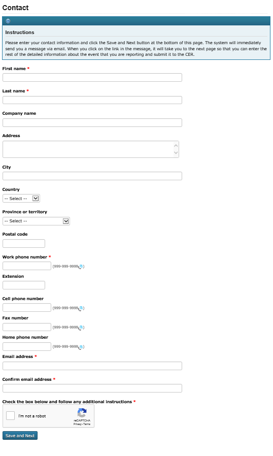

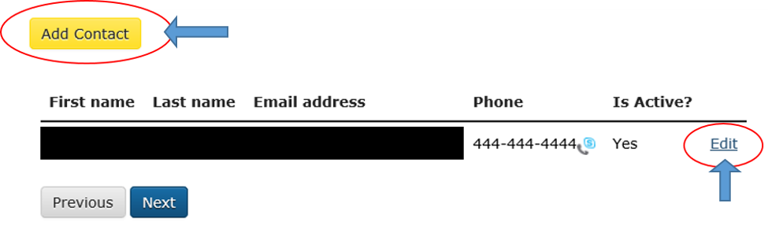

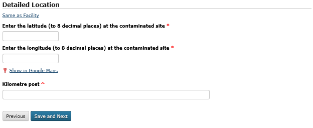

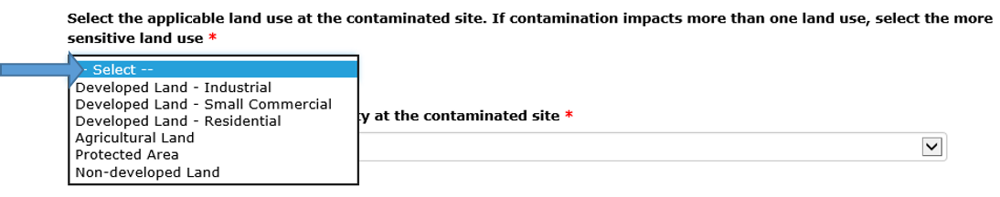
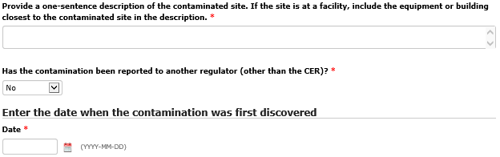
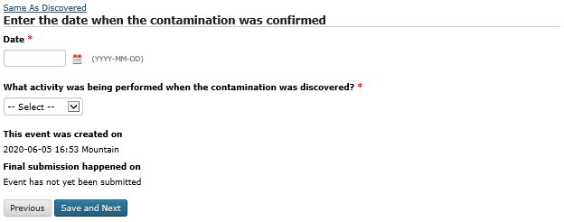

.. |image15| image:: media/image15.png
   :width: 6.50000in
   :height: 0.90354in

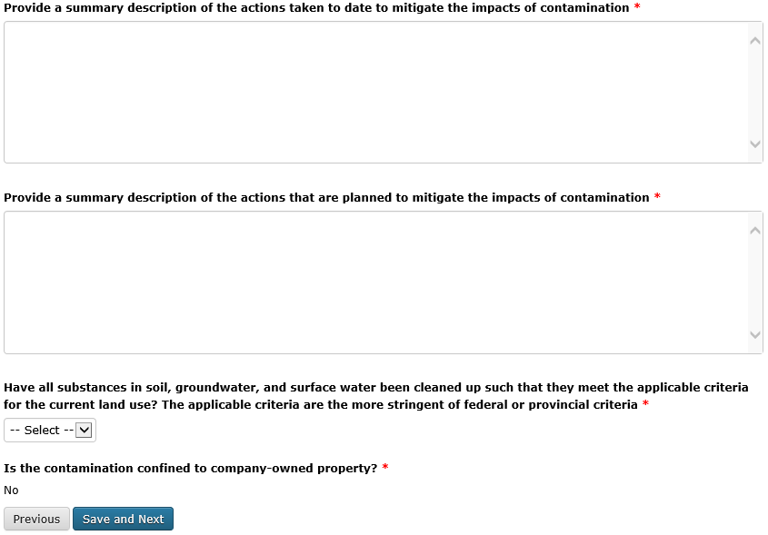

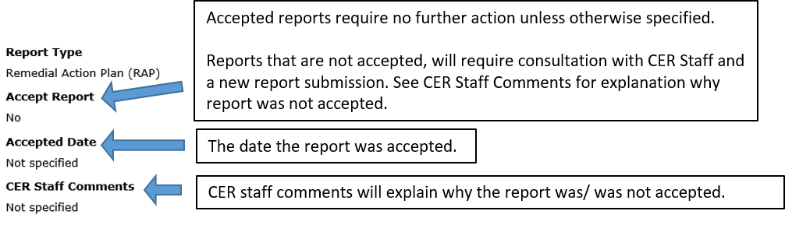
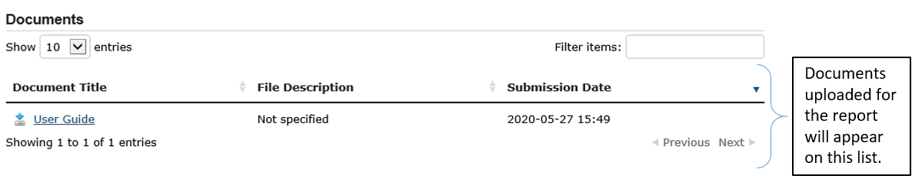

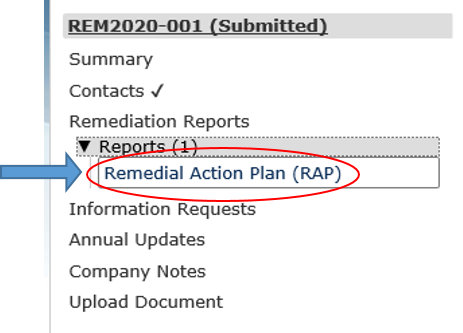

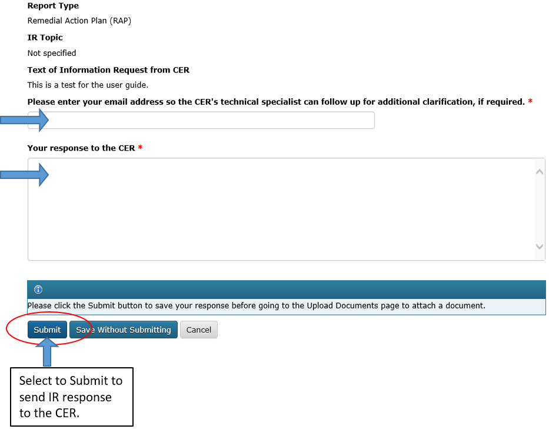

